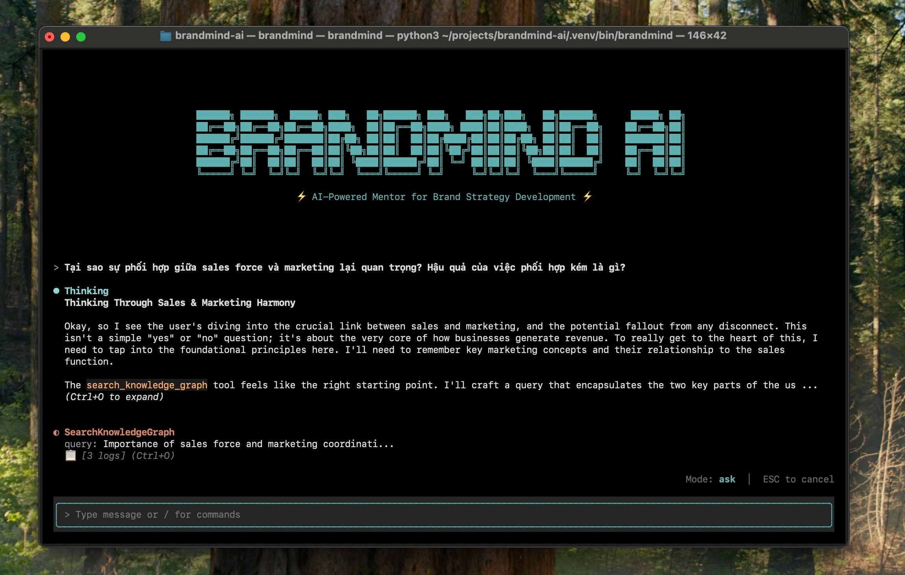

# BrandMind AI: AI-powered Mentor for Brand Strategy Development

<p align="center">
  <a href="https://github.com/lehoanganhtai13/brandmind-ai/actions/workflows/ci.yml"></a>
  <a href="LICENSE"></a>
  
</p>

<p align="center">
  
</p>

**BrandMind AI** is an intelligent mentor designed to guide junior marketers through the complex process of brand strategy development, bridging the gap between academic theory and real-world practice.

## 🚀 About The Project

In the marketing world, there's a significant **"Experience Gap"** for junior professionals. They often lack:
*   **Strategic Direction:** Difficulty translating business goals into a coherent brand roadmap.
*   **Expert Guidance:** Limited access to senior mentorship to challenge and refine their ideas.
*   **Resource Constraints:** Inability to afford expensive courses or consultancy.

BrandMind AI is not just another automation tool. It's a **cognitive augmentation system** designed to act as a virtual senior strategist. It doesn't just give you the answers; it teaches you **how to think** by simulating a real-world mentorship process.

## ✨ Key Features

- **Automated Document Parsing**: Ingests and understands PDF documents, extracting key information and summaries.
- **Intelligent Web Crawling**: Crawls websites to gather relevant brand and market data using [`Crawl4AI`](https://github.com/unclecode/crawl4ai).
- **Advanced Search**: Utilizes a private, aggregated search engine ([`SearXNG`](https://github.com/searxng/searxng)) to find the most relevant information.
- **Vector Search**: Powered by [`Milvus`](https://milvus.io/) for semantic similarity search and RAG applications.
- **Knowledge Graphs**: Uses [`FalkorDB`](https://www.falkordb.com/) for storing and querying complex relationships with Cypher.
- **AI-Powered Analytics**: Employs Large Language Models (LLMs) for content summarization, analysis, and trend identification.
- **Modular & Extensible**: Built with a clean, service-oriented architecture for easy extension and maintenance.

## 🚀 Getting Started

Follow these steps to get your local development environment up and running.

### 1. Prerequisites

- **Python 3.12**
- **[uv](https://github.com/astral-sh/uv)**: An extremely fast Python package installer and resolver.
- **[Docker](https://www.docker.com/)**: For running the required infrastructure services.

### 2. Clone the Repository

```bash
git clone https://github.com/lehoanganhtai13/brandmind-ai.git
cd brandmind-ai
```

### 3. Configure Environment Variables

Copy the template environment file and fill in your API keys:

```bash
cp environments/.template.env .env
```

Edit `.env` and add your API keys:

| Variable | Description | Get it from |
|----------|-------------|-------------|
| `GEMINI_API_KEY` | Google Gemini LLM & Embedding API | [Google AI Studio](https://aistudio.google.com/) |
| `LLAMA_PARSE_API_KEY` | LlamaParse PDF→Markdown parser | [LlamaIndex](https://www.llamaindex.ai/llamaparse) |

> **Note**: Database credentials (Milvus, FalkorDB, MinIO) have sensible defaults in the template. Adjust them for production deployments.

### 4. Start Infrastructure Services

The project uses several self-hosted services for data processing, search, and storage. Start them using Docker Compose:

```bash
make services-up
```

This will start the following services:

#### Search & Crawling
- **[SearXNG](https://github.com/searxng/searxng)** (port 8080): Privacy-focused metasearch engine aggregating results from multiple sources
- **[Crawl4AI](https://github.com/unclecode/crawl4ai)** (port 11235): Advanced web scraping service for extracting structured data

#### Databases
- **[FalkorDB](https://www.falkordb.com/)**: Graph database for knowledge graphs and GraphRAG
  - Server (port 6380): Graph database with Cypher query language
  - Browser UI (port 3000): Web interface for managing graphs
- **[Milvus](https://milvus.io/)**: Vector database for AI/ML applications
  - Server (ports 19530, 9091): Vector search engine
  - Attu UI (port 3001): Web interface for managing collections
  - MinIO (ports 9000-9001): Object storage backend
  - etcd (internal): Metadata storage

**Check service status:**
```bash
make services-status
```

**View logs:**
```bash
make services-logs
```

**Stop services:**
```bash
make services-down
```

> **Note**: Each service has detailed documentation in `infra/services/<service-name>/README.md` including configuration, authentication, and usage examples.

### 5. Install Dependencies

Install all required Python packages for all services using `uv`:

```bash
make install-all
```

### 6. Restore Databases (Recommended)

The repository includes pre-built knowledge graph backups in `backups/`. Restore them to get started immediately without building from scratch:

```bash
# Restore from backup package
make restore-package
```

This will restore the complete knowledge graph built from marketing textbooks, ready for querying.

### 7. Build Knowledge Graph (Optional)

If you want to build the knowledge graph from your own documents:

#### Step 1: Prepare your documents

1. Place your PDF files in `data/raw_documents/`
2. Create/update `data/raw_documents/document_metadata.json`:
   ```json
   [
     {
      "document_name": "your_document.pdf",
      "document_title": "Your Document Title",
      "author": "Your Document Author"
     }
   ]
   ```

#### Step 2: Parse PDF documents to markdown

```bash
# Process all documents listed in document_metadata.json
parse-docs

# Or process a specific file (must exist in metadata)
parse-docs --file "your_document.pdf"

# Optional skip flags:
# --skip-table-merge, --skip-text-merge, --skip-table-summarization, --skip-content-cleanup

# Re-apply content cleanup to existing parsed folder (without re-parsing PDF)
parse-docs --cleanup-folder YOUR_PARSED_FOLDER_NAME
```

Output will be saved to `data/parsed_documents/<DocumentName_Timestamp>/page_*.md`

#### Step 3: Build knowledge graph

```bash
# Run all stages (folder name from Step 2 output)
build-kg --folder YOUR_PARSED_FOLDER_NAME --stage all

# Or run individual stages:
build-kg --folder YOUR_PARSED_FOLDER_NAME --stage mapping
build-kg --folder YOUR_PARSED_FOLDER_NAME --stage chunking
build-kg --folder YOUR_PARSED_FOLDER_NAME --stage extraction
build-kg --folder YOUR_PARSED_FOLDER_NAME --stage validation
build-kg --folder YOUR_PARSED_FOLDER_NAME --stage indexing
build-kg --folder YOUR_PARSED_FOLDER_NAME --stage post-process
```

> **Note**: Building the full knowledge graph requires significant time and API calls. Use `--resume` flag to continue from a checkpoint if interrupted.

### 8. Running the CLI

BrandMind AI provides a powerful CLI with multiple interaction modes:

```bash
# Launch interactive TUI (default)
brandmind

# One-shot Q&A mode with AI agent
brandmind ask -q "What is Marketing Myopia?"

# Direct Knowledge Graph search
brandmind search-kg -q "customer value" -n 5

# Direct Document Library search
brandmind search-docs -q "pricing strategy" --chapter "Chapter 10"
```

You are now ready to start development!

## 🛠️ Development Workflow

We use a `Makefile` to streamline common development tasks.

### Code Quality

Run a full suite of checks, including formatting, linting, type-checking, and security scans. This is the primary command to ensure code quality before committing.

```bash
make typecheck
```

### Formatting

To format the code without running all checks:

```bash
make format
```

### Testing

The test suite currently includes integration tests that require the infrastructure services (see step 3) to be running.

```bash
# Run all tests
make test

# Run tests in watch mode
make test-watch
```

> **Note**: For a full list of available commands and their descriptions, run `make help`.

## 📦 Project Structure

```
brandmind-ai/
├── .github/workflows/   # CI/CD workflows (GitHub Actions)
├── src/
│   ├── cli/             # Command-line interface and TUI application
│   ├── shared/          # Shared utilities, models, and database clients
│   ├── core/            # Core business logic and processing pipelines
│   ├── config/          # System-wide configuration management
│   └── prompts/         # LLM prompts organized by feature
├── tests/               # Test suites (unit, integration, e2e)
├── infra/               # Infrastructure services (Docker Compose)
│   ├── docker-compose.yml  # Main orchestration file
│   └── services/           # Individual service configurations
│       ├── searxng/        # Privacy-focused search engine
│       ├── crawl4ai/       # Web scraping service
│       ├── valkey/         # Key-value cache
│       ├── falkordb/       # Graph database
│       └── milvus/         # Vector database
├── data/                # Data storage (PDFs, parsed documents, embeddings)
├── docs/                # Technical documentation and research notes
├── evaluation/          # Evaluation datasets and benchmarks
├── scripts/
│   └── migration/       # Database backup/restore scripts
├── backups/             # Database backup files (git-ignored)
├── tasks/               # Detailed task and feature documentation
├── media/               # Media assets (screenshots, images)
├── pyproject.toml       # Project metadata and dependencies (PEP 621)
└── Makefile             # Command runner for development tasks
```

## 🤝 Contributing

Contributions are welcome! Please feel free to submit a Pull Request. For major changes, please open an issue first to discuss what you would like to change.

When contributing, please follow a rebase workflow rather than a merge workflow for your Pull Requests to maintain a clean commit history.

1.  Fork the Project
2.  Create your Feature Branch (`git checkout -b feature/AmazingFeature`)
3.  Commit your Changes (`git commit -m 'feat: Add some AmazingFeature'`)
4.  Rebase your branch onto the target branch (e.g., `main`)
5.  Push to the Branch (`git push --force-with-lease origin feature/AmazingFeature`)
6.  Open a Pull Request

## 📄 License

This project is licensed under the MIT License - see the [LICENSE](LICENSE) file for details.
