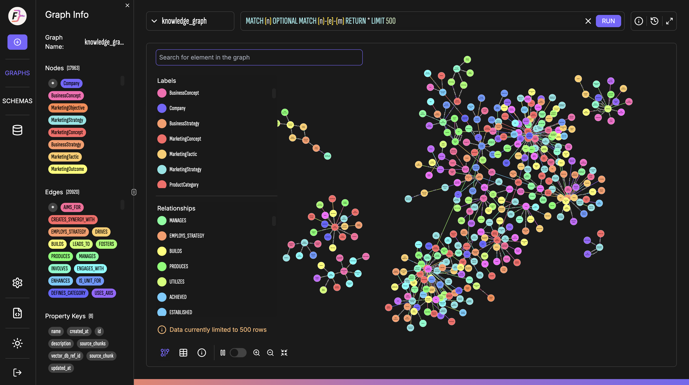

# BrandMind AI: AI-powered Mentor for Brand Strategy Development

<p align="center">
  <a href="https://github.com/lehoanganhtai13/brandmind-ai/actions/workflows/ci.yml"></a>
  <a href="LICENSE"></a>
  
</p>

<p align="center">
  
</p>

**BrandMind AI** is an intelligent mentor designed to guide junior marketers through the complex process of brand strategy development, bridging the gap between academic theory and real-world practice.

## 🚀 About The Project

In the marketing world, there's a significant **"Experience Gap"** for junior professionals. They often lack:

* **Strategic Direction:** Difficulty translating business goals into a coherent brand roadmap.
* **Expert Guidance:** Limited access to senior mentorship to challenge and refine their ideas.
* **Resource Constraints:** Inability to afford expensive courses or consultancy.

BrandMind AI is not just another automation tool. It's a **cognitive augmentation system** designed to act as a virtual senior strategist. It doesn't just give you the answers; it teaches you **how to think** by simulating a real-world mentorship process.

## ✨ Key Features

- **Automated Document Parsing**: Ingests and understands PDF documents, extracting key information and summaries.
- **Intelligent Web Crawling**: Crawls websites to gather relevant brand and market data using [`Crawl4AI`](https://github.com/unclecode/crawl4ai).
- **Advanced Search**: Utilizes a private, aggregated search engine ([`SearXNG`](https://github.com/searxng/searxng)) to find the most relevant information.
- **Vector Search**: Powered by [`Milvus`](https://milvus.io/) for semantic similarity search and RAG applications.
- **Knowledge Graphs**: Uses [`FalkorDB`](https://www.falkordb.com/) for storing and querying complex relationships with Cypher.
- **AI-Powered Analytics**: Employs Large Language Models (LLMs) for content summarization, analysis, and trend identification.
- **Modular & Extensible**: Built with a clean, service-oriented architecture for easy extension and maintenance.

## 🚀 Getting Started

Follow these steps to get your local development environment up and running.

### 1. Prerequisites

- **[uv](https://github.com/astral-sh/uv)**: An extremely fast Python package manager. It will automatically download and manage Python for you.
- **[Docker](https://www.docker.com/)**: For running the required infrastructure services.

### 2. Clone the Repository

```bash
git clone https://github.com/lehoanganhtai13/brandmind-ai.git
cd brandmind-ai
```

### 3. Configure Environment Variables

Run the interactive setup wizard to configure your environment:

```bash
make setup-env
```

This will prompt you for each configuration value. Only `GEMINI_API_KEY` is required - all other values have sensible defaults for local development.

| Variable                | Required    | Description                       | Get it from                                     |
| ----------------------- | ----------- | --------------------------------- | ----------------------------------------------- |
| `GEMINI_API_KEY`      | ✅ Yes      | Google Gemini LLM & Embedding API | [Google AI Studio](https://aistudio.google.com/)   |
| `LLAMA_PARSE_API_KEY` | ❌ Optional | LlamaParse PDF→Markdown parser   | [LlamaIndex](https://www.llamaindex.ai/llamaparse) |
| `PERPLEXITY_API_KEY`  | ❌ Optional | Perplexity AI search provider     | [Perplexity](https://www.perplexity.ai/)           |
| `TAVILY_API_KEY`      | ❌ Optional | Tavily web search provider        | [Tavily](https://tavily.com/)                      |

After setup, load the environment variables:

```bash
source environments/.env.export
```

<details>
<summary>📝 Manual Setup (Alternative)</summary>

If you prefer manual configuration:

```bash
cp environments/.template.env environments/.env
# Edit environments/.env and add your GEMINI_API_KEY
```

</details>

> **Note**: Database credentials (Milvus, FalkorDB, MinIO) have sensible defaults that work with the local Docker services. Adjust them for production deployments.

### 4. Start Infrastructure Services

The project uses several self-hosted services for data processing, search, and storage. Start them using Docker Compose:

```bash
make services-up
```

This will start the following services:

#### Search & Crawling

- **[SearXNG](https://github.com/searxng/searxng)** (port 8080): Privacy-focused metasearch engine aggregating results from multiple sources
- **[Crawl4AI](https://github.com/unclecode/crawl4ai)** (port 11235): Advanced web scraping service for extracting structured data

#### Databases

- **[FalkorDB](https://www.falkordb.com/)**: Graph database for knowledge graphs and GraphRAG
  - Server (port 6380): Graph database with Cypher query language
  - Browser UI (port 3000): Web interface for managing graphs
- **[Milvus](https://milvus.io/)**: Vector database for AI/ML applications
  - Server (ports 19530, 9091): Vector search engine
  - Attu UI (port 3001): Web interface for managing collections
  - MinIO (ports 9000-9001): Object storage backend
  - etcd (internal): Metadata storage

#### Search Providers

Web search supports multiple providers with automatic fallback:

| Provider             | API Key                | Notes                            |
| -------------------- | ---------------------- | -------------------------------- |
| **SearXNG**    | Not required           | Self-hosted, included by default |
| **Perplexity** | `PERPLEXITY_API_KEY` | AI-powered search                |
| **Tavily**     | `TAVILY_API_KEY`     | Web search API                   |
| **Bing**       | Not required           | Fallback option                  |

> **Tip**: Run `make setup-env` to configure API keys. Use `make services-up SKIP_SEARXNG=true` if you only want to use external providers.

**Check service status:**

```bash
make services-status
```

**View logs:**

```bash
make services-logs
```

**Stop services:**

```bash
make services-down
```

> **Note**: Each service has detailed documentation in `infra/services/<service-name>/README.md` including configuration, authentication, and usage examples.

### 5. Install Dependencies

Install all required Python packages for all services using `uv`:

```bash
make install-all
```

### 6. Restore Databases (Recommended)

The repository includes pre-built knowledge graph backups in `backups/`. Restore them to get started immediately without building from scratch:

```bash
# Restore from backup package
make restore-package
```

This will restore the complete knowledge graph built from marketing textbooks, ready for querying.

<details>
<summary>📚 Knowledge Graph Contents (after restore)</summary>

The pre-built knowledge graph contains **27,143 entity nodes** and **30,448 relationships** extracted from 5 authoritative marketing textbooks:

| Book                                                     | Author                        | Knowledge Domains                                                                                        |
| -------------------------------------------------------- | ----------------------------- | -------------------------------------------------------------------------------------------------------- |
| **Principles of Marketing** (17th Ed)              | Philip Kotler, Gary Armstrong | Marketing fundamentals, STP framework, marketing mix (4Ps), consumer behavior, market research           |
| **Strategic Brand Management**                     | Kevin Lane Keller             | CBBE Pyramid, brand equity measurement, Brand Value Chain, brand positioning, brand portfolio strategy   |
| **Positioning: The Battle for Your Mind**          | Al Ries & Jack Trout          | Mental positioning, competitive differentiation, category strategy, laddering techniques                 |
| **How Brands Grow: What Marketers Don't Know**     | Byron Sharp                   | Evidence-based marketing laws, double jeopardy, mental & physical availability, Distinctive Brand Assets |
| **Influence: The Psychology of Persuasion** (2021) | Robert B. Cialdini            | 7 principles of persuasion (reciprocity, commitment, social proof, authority, liking, scarcity, unity)   |

</details>

<p align="center">
  
</p>

### 7. Extend Knowledge Graph (Optional)

The knowledge graph pipeline is **additive** — each document you process adds new entities and relationships to the existing graph. This means:

- **If you restored from backup (Step 6)**: New documents will extend the pre-built knowledge graph with additional domain knowledge.
- **If you skipped Step 6**: The pipeline will build a fresh knowledge graph from scratch using your documents.

#### Step 1: Prepare your documents

1. Place your PDF files in `data/raw_documents/`
2. Add your document to `data/raw_documents/document_metadata.json`:
   ```json
   [
     {
      "document_name": "your_document.pdf",
      "document_title": "Your Document Title",
      "author": "Your Document Author"
     }
   ]
   ```

#### Step 2: Parse PDF documents to markdown

```bash
# Process all documents listed in document_metadata.json
parse-docs

# Or process a specific file (must exist in metadata)
parse-docs --file "your_document.pdf"

# Optional skip flags:
# --skip-table-merge, --skip-text-merge, --skip-table-summarization, --skip-content-cleanup

# Re-apply content cleanup to existing parsed folder (without re-parsing PDF)
parse-docs --cleanup-folder YOUR_PARSED_FOLDER_NAME
```

Output will be saved to `data/parsed_documents/<DocumentName_Timestamp>/page_*.md`

#### Step 3: Build knowledge graph

We recommend running each stage individually for better control over the build process. If a stage fails, you can re-run just that stage instead of restarting from the beginning:

```bash
# Recommended: run stages individually (folder name from Step 2 output)
build-kg --folder YOUR_PARSED_FOLDER_NAME --stage mapping
build-kg --folder YOUR_PARSED_FOLDER_NAME --stage chunking
build-kg --folder YOUR_PARSED_FOLDER_NAME --stage extraction
build-kg --folder YOUR_PARSED_FOLDER_NAME --stage validation
build-kg --folder YOUR_PARSED_FOLDER_NAME --stage indexing
build-kg --folder YOUR_PARSED_FOLDER_NAME --stage post-process

# Or run all stages at once (not recommended for large documents)
build-kg --folder YOUR_PARSED_FOLDER_NAME --stage all
```

> **Note**: Building the knowledge graph requires significant time and API calls. The `extraction` stage supports `--resume` to continue from a checkpoint if interrupted.

#### Step 4: Backup your knowledge graph

After successfully extending the knowledge graph, it's recommended to create a backup. This allows you to restore the data on another machine or recover if something goes wrong:

```bash
make backup-package
```

### 8. Running the CLI

BrandMind AI provides a powerful CLI with multiple interaction modes:

```bash
# Launch interactive TUI (default)
brandmind

# One-shot Q&A mode with AI agent
brandmind ask -q "What is Marketing Myopia?"

# Direct Knowledge Graph search
brandmind search-kg -q "customer value" -n 5

# Direct Document Library search
brandmind search-docs -q "pricing strategy" --chapter "Chapter 10"
```

You are now ready to start development!

## 🛠️ Development Workflow

We use a `Makefile` to streamline common development tasks.

### Code Quality

Run a full suite of checks, including formatting, linting, type-checking, and security scans. This is the primary command to ensure code quality before committing.

```bash
make typecheck
```

### Formatting

To format the code without running all checks:

```bash
make format
```

### Testing

The test suite currently includes integration tests that require the infrastructure services (see step 3) to be running.

```bash
# Run all tests
make test

# Run tests in watch mode
make test-watch
```

> **Note**: For a full list of available commands and their descriptions, run `make help`.

## 📦 Project Structure

```
brandmind-ai/
├── .github/workflows/   # CI/CD workflows (GitHub Actions)
├── src/
│   ├── cli/             # Command-line interface and TUI application
│   ├── shared/          # Shared utilities, models, and database clients
│   ├── core/            # Core business logic and processing pipelines
│   ├── config/          # System-wide configuration management
│   └── prompts/         # LLM prompts organized by feature
├── tests/               # Test suites (unit, integration, e2e)
├── infra/               # Infrastructure services (Docker Compose)
│   ├── docker-compose.yml  # Main orchestration file
│   └── services/           # Individual service configurations
│       ├── searxng/        # Privacy-focused search engine
│       ├── crawl4ai/       # Web scraping service
│       ├── valkey/         # Key-value cache
│       ├── falkordb/       # Graph database
│       └── milvus/         # Vector database
├── data/                # Data storage (PDFs, parsed documents, embeddings)
├── docs/                # Technical documentation and research notes
├── evaluation/          # Evaluation datasets and benchmarks
├── scripts/
│   └── migration/       # Database backup/restore scripts
├── backups/             # Database backup files (git-ignored)
├── tasks/               # Detailed task and feature documentation
├── media/               # Media assets (screenshots, images)
├── pyproject.toml       # Project metadata and dependencies (PEP 621)
└── Makefile             # Command runner for development tasks
```

## 🤝 Contributing

Contributions are welcome! Please feel free to submit a Pull Request. For major changes, please open an issue first to discuss what you would like to change.

When contributing, please follow a rebase workflow rather than a merge workflow for your Pull Requests to maintain a clean commit history.

1. Fork the Project
2. Create your Feature Branch (`git checkout -b feature/AmazingFeature`)
3. Commit your Changes (`git commit -m 'feat: Add some AmazingFeature'`)
4. Rebase your branch onto the target branch (e.g., `main`)
5. Push to the Branch (`git push --force-with-lease origin feature/AmazingFeature`)
6. Open a Pull Request

## 📄 License

This project is licensed under the MIT License - see the [LICENSE](LICENSE) file for details.
