# Page 298

**Document Title**: Strategic Brand Management: Building, Measuring, and Managing Brand Equity
**Author**: Kevin Lane Keller
**Original File**: data/raw_documents/Strategic_Brand_Management.pdf
**Page Number**: 298/591
**Processing Time**: 2026-02-06T16:53:10.268718

---

```mermaid
graph TD
    MTV["MTV Logo"]
    MTV --> Trendsetter["Trendsetter"]
    MTV --> Changing["Changing"]
    MTV --> Original["Original"]
    MTV --> Real_and_genuine["Real and genuine"]
    MTV --> For_me["For me"]
    MTV --> Fun_and_entertaining["Fun and entertaining"]
    MTV --> Young["Young"]
    MTV --> Hip_and_cool["Hip and cool"]
    MTV --> Irreverent_and_rebellious["Irreverent and rebellious"]
    MTV --> Popular["Popular"]
    MTV --> Interactive["Interactive"]
    MTV --> Connected["Connected"]
    MTV --> Live_and_immediate["Live and immediate"]
    MTV --> Lifestyle["Lifestyle"]
    MTV --> Music["Music"]
    MTV --> Informative["Informative"]
    MTV --> Trusting["Trusting"]
    MTV --> Mainstream["Mainstream"]
    MTV --> Leader["Leader"]
    MTV --> Popular2["Popular"]
```

This table outlines the possible core brand associations for MTV, presenting a set of key attributes that define its identity. These associations are categorized into distinct themes, including "Music," emphasizing current and new trends; "Credibility," reflecting expertise, trust, and reality; and "Personality," characterized by irreverence, hipness, and coolness. Further dimensions include "Accessibility," indicating relevance and broad appeal; "Interactivity," highlighting connection and participation; and "Community," fostering shared experiences and discussion. The brand is also associated with being "Modern," again emphasizing hipness and coolness, and "Spontaneity," signifying immediacy and up-to-the-minute content. Finally, "Originality" points to genuineness and creativity, while "Fluidity" underscores a constant state of change and evolution. Collectively, these associations paint a picture of a dynamic, engaging, and culturally relevant brand.

A related methodology, brand concept maps (BCM), elicits brand association networks (brand maps) from consumers and aggregates individual maps into a consensus map.9 This approach structures the brand elicitation stage of identifying brand associations by providing survey respondents with a set of brand associations used in the mapping stage. The mapping stage is also structured and has respondents use the provided set of brand associations to build an individual brand map that shows how brand associations are linked to each other and to the brand, as well as how strong these linkages are. Finally, the aggregation stage is also structured and analyzes individual brand maps step by step, uncovering the common thinking involved. Figure 8-4 displays a brand concept map for the Mayo Clinic (the subject of Branding Brief 8-2) provided by a sample of patients.

One goal from qualitative, as well as quantitative, research in the brand exploratory is a clear, comprehensive profile of the target market. As part of that process, many firms are literally creating personas to capture their views as to the target market, as summarized in The Science of Branding 8-1.

