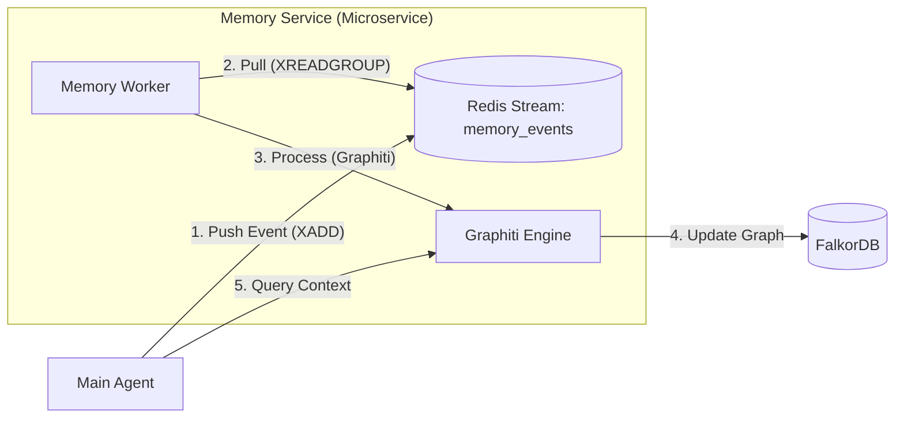

# BrandMind AI - Memory & Personalization Architecture
> **Purpose**: This technical specification defines the **Persona Memory System (PMS)** for BrandMind AI. Use this document as the source of truth for implementing memory, personalization, and context management.

**Last Updated**: 2026-02-11
**Version**: 2.0 (Custom Service & Event-Driven)
**Status**: Proposal

---

## 1. Core Philosophy

### 1.1 "The Portable User Context"
The user's context is a portable container comprising their identity, preferences, and workspace. The agent "mounts" this context at startup.
- **Local Mode**: Context is mapped to local disk & local databases.
- **Cloud Mode**: Context is mapped to S3 & multi-tenant database clusters.

### 1.2 "Universal Chat"
Unlike standard chat apps with multiple "threads", BrandMind treats the relationship with the user as a **Single Continuous Thread** (like a Facebook Messenger chat with a friend).
- **Short-Term Memory**: The actual chat history window (e.g., last 20 messages).
- **Long-Term Memory**: Everything else, consolidated into the Knowledge Graph and Filesystem.

### 1.3 "Interface-First" Design
All external dependencies (Filesystem, Memory, Broker) are abstracted behind interfaces. The agent logic **never imports specific implementations** (like `Redis` or `S3`), only protocols. This guarantees seamless switching between Local and Enterprise Cloud modes.

---

## 2. Memory Types & Storage

We implement 4 distinct types of memory:

| Memory Type | Description | Storage Implementation | Managed By |
| :--- | :--- | :--- | :--- |
| **Short-Term** | Immediate conversation context. | **Redis / Valkey** (List/Stream) | Main Agent Code |
| **Episodic** | "I remember we discussed X last Tuesday." | **FalkorDB** (Time-aware Graph) | **Custom Memory Service** |
| **Semantic** | "User prefers 'Professional' tone." | **FalkorDB** (Facts & Relations) | **Custom Memory Service** |
| **Procedural** | "Here is how to do Market Research." | **Codebase** (Agent Skills) | Developer (Hardcoded) |
| **Explicit** | User notes, profiles, drafts. | **Virtual Filesystem** (VFS) | Agent Tools (VFS) |

---

## 3. Architecture Components

### 3.1 Component A: The Virtual Filesystem (VFS) -> Explicit Memory

**Purpose**: Stores unstructured data, working drafts, and explicit user notes.
**Implementation**: `deepagents.middleware.filesystem` leveraging `BackendProtocol`.

- **Local Mode**: `FilesystemBackend` -> `~/.brandmind/workspace/`
- **Cloud Mode**: `S3Backend` -> `s3://brandmind-users/{tenant_id}/`

**Agent View**:
```text
/
├── .profile/           # User bio, preferences (auto-synced)
├── notes/              # User's manual notes
├── drafts/             # Work-in-progress deliverables
└── system/             # Configs
```

### 3.2 Component B: Custom Memory Service -> Episodic & Semantic

**Purpose**: Asynchronously ingest interactions to build the long-term knowledge graph.
**Engine**: **Graphiti** (Python Library) + **FalkorDB**.
**Architecture**: Event-Driven Microservice.



**Why Redis Streams? (Not Pub/Sub)**
We use **Redis Streams** (specifically Consumer Groups), which works differently from standard Pub/Sub:

1.  **Persistence (Log)**: Unlike Pub/Sub (Fire-and-forget), Streams persist messages. If the Memory Service is down, the chat logs wait in the stream until it comes back online. No data loss.
2.  **Consumer Groups (Pull Mode)**:
    *   **Worker Mode**: The Memory Service registers as a **Consumer Group**.
    *   **Pull Mechanism**: It explicitly "pulls" messages using `XREADGROUP`.
    *   **Reliability**: It must send an `XACK` (Acknowledgement) after successfully processing/ingesting a memory. If it crashes while processing, the message remains "Pending" and is retried by another worker.
3.  **Order Guarantee**: Messages are processed in the exact order they were received (Time-series), which is critical for **Episodic Memory**.

**Workflow**:
1.  **Chat**: User sends message -> Agent replies.
2.  **Publish**: Agent publishes interaction to Redis Stream `memory_events`.
3.  **Async Process**: Memory Service acts as a consumer group worker. It picks up the event.
    *   Uses **Graphiti** to extract entities/relations.
    *   Updates the **FalkorDB** graph for that specific `user_id`.
4.  **Retrieval**: On next turn, Agent queries Memory Service (or directly FalkorDB) to retrieve relevant context.

### 3.3 Component C: Procedural Memory -> Agent Skills

**Purpose**: "Muscle memory" on how to perform tasks.
**Implementation**: Existing **Agent Skills** system (`.gemini/antigravity/skills/*`).

---

### 3.4 Message Broker Strategy: "Interface-First"

We will implement an abstract `MessageBroker` interface to support differents backends for Local vs. Cloud.

**Why Redis Streams for Local/MVP?**
*   **Zero-Config**: Users already have Redis (Valkey) for caching. No need to install the heavy Google Cloud Pub/Sub Emulator (Java-based).
*   **Low Latency**: In-memory speeds perfect for chat responsiveness.
*   **Persistence**: Configurable via AOF/RDB.

**Why Google Pub/Sub for Cloud Scale (Future)?**
*   **Serverless Scaling**: Handles millions of users without managing RAM.
*   **Global Distribution**: Better for a distributed SaaS.

**Implementation Strategy**:
Code agent against the *Interface*, not the implementation.
```python
class MessageBroker(ABC):
    async def publish(self, topic: str, event: dict): ...
    async def subscribe(self, topic: str, group_id: str): ...
```
Phase 1 uses `RedisBroker`. Phase 2 (Cloud) adds `GooglePubSubBroker`.

---

## 4. Implementation Roadmap

### Phase 1: Local Foundation (Target v0.5.0)
**Goal**: Get the full architecture running on a single developer machine.

1.  **Infrastructure**:
    *   Redis (Valkey): Already exists. Enable Streams.
    *   FalkorDB: Already exists.
2.  **Memory Service**:
    *   Build a simple Python worker script using `graphiti_core` and `redis-py`.
    *   Run as a separate Docker container `memory-worker`.
3.  **Agent**:
    *   Configure VFS to local disk.
    *   Implement `AsyncMemoryPublisher` to push to Redis.

### Phase 2: Cloud Sync & Scale (Target v1.0.0)
**Goal**: Enable multi-tenancy and syncing.

1.  **VFS**: Implement `S3Backend` adapter.
2.  **Memory Service**:
    *   Deploy `memory-worker` as a scalable k8s deployment.
    *   Ensure `graphiti` uses `tenant_id` for graph isolation in FalkorDB.
3.  **API**: Add authenticated endpoints for the frontend to query memory state.

---

## 5. Technical Stack Summary

*   **Language**: Python 3.12+
*   **Queue**: Redis Streams (Valkey)
*   **Graph Engine**: Graphiti (Library)
*   **Graph DB**: FalkorDB
*   **Filesystem**: DeepAgents FS Middleware + S3 Adapter
