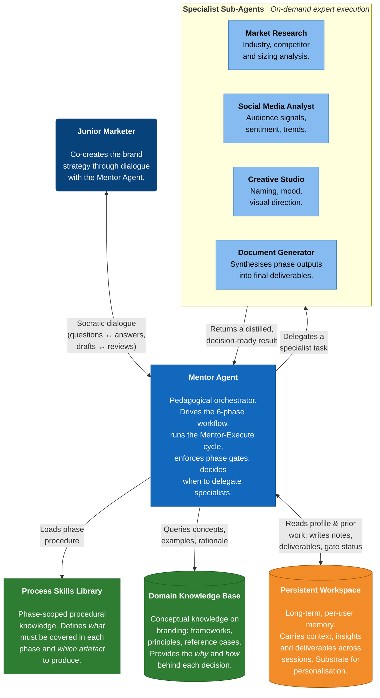
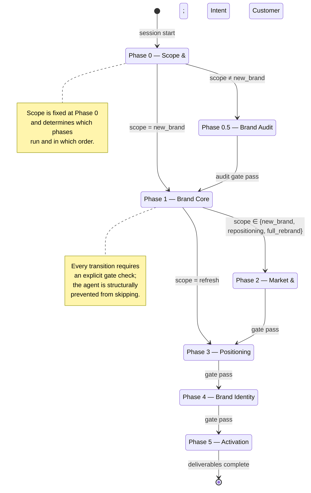
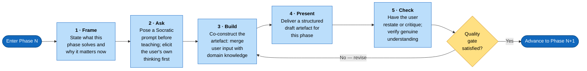

# BrandMind AI — Functional Architecture

Tài liệu này mô tả kiến trúc chức năng của BrandMind — các khối thành phần cốt lõi,
lý do cấu trúc được tổ chức theo cách này, và phương pháp đánh giá hệ thống. Các lớp
engineering (giao vận, quản lý phiên, hạ tầng) được đặt ngoài phạm vi, vì chúng là
phương tiện triển khai chứ không phải đóng góp nghiên cứu.

Năm phần dưới đây lần lượt trả lời năm câu hỏi cốt lõi:

1. **Core Components** — Hệ thống gồm những khối chức năng nào, mỗi khối làm gì?
2. **Phase Workflow** — Người học được dẫn dắt qua quy trình nào?
3. **Mentor–Execute Cycle** — Bên trong một phase, quá trình dạy–làm diễn ra ra sao?
4. **Contribution Mapping** — Mỗi đóng góp của luận án nằm ở đâu trong kiến trúc?
5. **Evaluation Methodology** — Hệ thống được chứng minh là hoạt động bằng cách nào?

---

## 1. Core Components

BrandMind được tổ chức quanh **năm khối chức năng**, trong đó *Mentor Agent* giữ vai
trò trung tâm. Cách phân chia này xuất phát từ yêu cầu tách bạch rõ ràng các vai trò:
*sư phạm*, *chuyên môn*, *tri thức quy trình*, *tri thức chuyên ngành*, và *trí nhớ
dài hạn* — để mỗi phần có thể được điều chỉnh, đánh giá, và bảo vệ một cách độc lập.

### Vai trò của từng khối

- **Mentor Agent** là não sư phạm trung tâm. Nó kiểm soát việc tiến qua các phase,
  chạy vòng Mentor–Execute, enforce các gate, và quyết định khi nào cần gọi specialist.
  Khối này được đặt ở trung tâm vì toàn bộ tính chất *mentor-first* của hệ thống phụ
  thuộc vào cách nó ra quyết định — nếu logic ở đây sai, các khối còn lại không đủ
  để bù.

- **Specialist Sub-Agents** gồm bốn chuyên gia hẹp (research, social, creative,
  document). Việc tách chuyên môn ra khỏi Mentor Agent là để tránh kéo nặng não sư
  phạm bằng các tác vụ chuyên sâu. Khi cần nghiên cứu thị trường, Mentor gọi specialist
  và nhận lại kết quả đã được chắt lọc, thay vì tự xử lý và vỡ ngữ cảnh sư phạm.

- **Process Skills Library** chứa tri thức *quy trình* — cần làm gì ở mỗi phase,
  deliverable nào phải ra. Khối này được tách có chủ đích khỏi Knowledge Base để quy
  trình sư phạm có thể tiến hoá độc lập với nội dung chuyên ngành.

- **Domain Knowledge Base** chứa tri thức *khái niệm* về branding — *tại sao* và *làm
  thế nào* đằng sau các quyết định. Kết hợp Knowledge Graph và vector retrieval được
  dùng ở đây để Mentor tra cứu nhanh khi cần giảng một khái niệm.

- **Persistent Workspace** là trí nhớ dài hạn của từng user, lưu qua nhiều session.
  Khối này được coi là thành phần kiến trúc *first-class* — không phải cache — vì
  nếu hệ thống quên hết mỗi lần user quay lại, personalization thật sự không thể đạt
  được.

### Ba quyết định thiết kế then chốt

- **Tách *process* khỏi *domain knowledge*.** Tri thức "cần làm gì" không được trộn
  với tri thức "branding là gì". Khi quy trình sư phạm cần thay đổi, chỉ Skills bị
  đụng; khi nội dung chuyên ngành cần cập nhật, chỉ Knowledge Base bị đụng. Tính tách
  bạch này là một điểm chịu được phản biện về mở rộng và bảo trì.

- **Chuyên biệt hoá qua sub-agent thay vì agent đa năng.** Một agent đơn lẻ làm tất
  cả sẽ bị context pressure và mất tính nhất quán sư phạm khi phải nhảy qua các kiểu
  tác vụ khác nhau. Bốn specialist phản ánh cách một team branding thực sự vận hành.

- **Workspace là thành phần kiến trúc, không phải tính năng phụ.** Workspace được
  định hình từ đầu như nơi lưu profile người dùng, deliverable từng phase, và trạng
  thái quality gate — chứ không phải sinh ra sau khi hệ thống đã chạy. Đây là nền
  cho adaptive mentoring xuyên session.

---

## 2. Phase Workflow

Cuộc đối thoại không được phép chạy tự do. Mentor Agent phải đi qua một state machine
6 phase (+ phase 0.5 tuỳ scope), và việc chuyển phase chỉ xảy ra khi **quality gate**
của phase hiện tại được thoả — *không phải* khi người dùng yêu cầu đi tiếp.

**Scope quyết định đường đi.** Bốn scope ứng với bốn tình huống thực tế khác nhau, và
đường đi qua các phase cũng khác:

| Scope | Phase sequence |
|---|---|
| `new_brand` | 0 → 1 → 2 → 3 → 4 → 5 |
| `refresh` | 0 → 0.5 → 1 → 3 → 4 → 5 |
| `repositioning` | 0 → 0.5 → 1 → 2 → 3 → 4 → 5 |
| `full_rebrand` | 0 → 0.5 → 1 → 2 → 3 → 4 → 5 |

**Lý do đặt gate ở mỗi transition.** Một lỗi phổ biến của AI mentor dạng chatbot là
*premature closure* — khi người dùng nói "ok tôi hiểu rồi, đi tiếp đi", hệ thống
chiều theo dù deliverable còn sơ sài. Cơ chế gate được encode như một *invariant kiến
trúc*: chuyển phase là một thao tác có cấu trúc (phải gọi
`report_progress(advance=True)` và pass các tiêu chí gate), không phải một lời đồng ý
trong hội thoại. Agent *không có cách nào* skip phase kể cả khi muốn — đây là đóng góp
kỹ thuật đáng kể nhất của hệ thống.

---

## 3. Mentor–Execute Cycle (bên trong một phase)

Bên trong mỗi phase, Mentor Agent chạy một vòng lặp sư phạm **5 bước**, không phải một
pass "dạy xong rồi sinh output". Đây là hành vi phân biệt BrandMind với các
output-first assistant.

**Lý do chọn 5 bước thay vì 3.** Một vòng ngây thơ sẽ chỉ gồm *Dạy → Sinh output →
Duyệt*. Hai bước được chèn thêm có chủ đích:

- **Ask** — đặt *trước* khi dạy, buộc người dùng suy nghĩ và phát biểu trước. Không
  có bước này, mentor quay về chế độ truyền đạt một chiều.
- **Check** — đặt *sau* khi present, buộc người dùng diễn giải lại hoặc phản biện.
  Không có bước này, một câu "ok duyệt" không chứng minh được người dùng đã hiểu thật.

Hai bước chèn này chính là đòn bẩy tạo ra đóng góp sư phạm của hệ thống. Bỏ đi, hệ
thống chỉ còn là một chatbot có state machine.

**Workspace được dùng xuyên vòng lặp.**

- Bước **Frame** đọc `user/profile.md` và `brand_brief.md` để điều chỉnh độ sâu giảng
  và nối mạch từ phase trước.
- Bước **Build** ghi các insight quan trọng vào `working_notes.md`.
- Bước **Check** và quality gate cập nhật trạng thái vào `quality_gates.md`.

---

## 4. Contribution Mapping

Bảng dưới ánh xạ trực tiếp từng đóng góp của luận án sang thành phần kiến trúc đã hiện
thực hoá nó — để câu hỏi "đóng góp X nằm ở đâu trong hệ thống?" có câu trả lời cụ thể.

| Đóng góp luận án | Hiện thực hoá ở |
|---|---|
| Mentor-first AI (dạy *why*, không chỉ *what*) | Mentor–Execute cycle (§3) + gate-enforced phase transitions (§2) |
| Ngăn agent skip phase bằng cơ chế cấu trúc | Phase state machine với gate invariant (§2) |
| Tách tri thức quy trình khỏi tri thức chuyên ngành | Process Skills Library ↔ Domain Knowledge Base (§1) |
| Chuyên biệt hoá nhận thức qua task decomposition | Mentor Agent + 4 Specialist Sub-Agents (§1) |
| Cá nhân hoá dài hạn xuyên session | Persistent Workspace như first-class component (§1) |

---

## 5. Evaluation Methodology

Câu hỏi trung tâm: *kiến trúc mentor-first có thật sự tạo ra trải nghiệm mentoring
tốt hơn một chatbot LLM thuần hay không?* Pipeline đánh giá gồm 4 thành phần: ba
chiều đo, một thang rubric có ràng buộc cấu trúc, một ma trận thực nghiệm có kiểm
soát, và một panel judge đa nhà cung cấp.

### 5.1 Đánh giá cái gì — ba chiều

| Dimension | Weight | Đo cái gì |
|---|---|---|
| **Strategy Quality** | 50% | Brand strategy sinh ra có đúng, nhất quán, áp dụng được không? |
| **Mentoring** | 30% | Hệ thống có *dạy* và bắt người dùng *tư duy*, hay chỉ nhận output? |
| **Personalization** | 20% | Hệ thống có thích ứng theo scope, kinh nghiệm, bối cảnh từng người dùng? |

Strategy Quality chiếm một nửa vì một mentor không sinh được strategy đúng đã thất
bại ở nghĩa vụ cơ bản nhất. Mentoring 30% phản ánh định vị cốt lõi của hệ thống.
Personalization 20% vì nó là hệ quả của hai chiều kia.

### 5.2 Chấm điểm như thế nào — rubric

- **104 tiêu chí** chia theo 3 chiều, mỗi chiều tổ chức 3 tier: **GATE** (yêu cầu tối
  thiểu — fail khoá điểm chiều ≤ 5.0), **STD** (6.0–8.0), **EXCEL** (mở khoá 9.0–10.0).
- **10 anti-patterns** — tín hiệu âm cứng (vd. *"agent trả lời trước khi cho user
  suy nghĩ"*).
- **Quality-gate cap**: nếu Strategy Quality < 7.0, điểm tổng bị cap tại 6.0 — ngăn
  tình huống "duyên về mentoring nhưng strategy yếu" vẫn lấy điểm cao.
- **Ngưỡng đạt**: điểm tổng ≥ **8.0**.

### 5.3 Thiết kế thực nghiệm

Ma trận **5 personas × 3 systems × 2 runs = 30 sessions**.

| Persona | Role | Scope |
|---|---|---|
| Linh | Junior marketer | `new_brand` |
| Minh | Café owner | `full_rebrand` |
| Thao | Marketing manager | `new_brand` |
| Hai | Pho-shop owner | `refresh` |
| Huong | Brand executive | `repositioning` |

**3 hệ thống** so sánh trực tiếp: BrandMind (kiến trúc đầy đủ), ChatGPT vanilla,
Gemini vanilla. Hai baseline vanilla đóng vai trò *cô lập đóng góp của kiến trúc* —
nếu BrandMind ngang điểm với vanilla baseline, kiến trúc không tạo ra giá trị.

**2 runs** cho mỗi cấu hình để quan sát variance nội tại do LLM ngẫu nhiên ở T=1.0.

**Simulated user**: mỗi session vận hành bởi một LLM-driven actor đóng vai theo
persona spec. Đánh đổi tính tự nhiên của người dùng thật để đổi lấy *tái lập được* —
cần thiết để chạy cùng một persona qua cả 3 hệ thống trong cùng điều kiện.

### 5.4 Ai chấm điểm

- **Self-eval** ngay sau mỗi session — ghi lại cảm nhận trực tiếp của simulated user
  khi còn "nóng". Đây là tín hiệu judge không tái tạo được từ transcript.
- **3 LLM judges** từ 3 family khác nhau (Claude Sonnet 4.6, Gemini 3.1 Pro, GPT-5.4)
  ở T=1.0 — giảm systematic bias của bất kỳ nhà cung cấp nào.
- **Fleiss' Kappa** tính ở mức *từng tiêu chí* để kiểm tra 3 judge có đồng thuận
  thật sự hay đang chấm ngẫu nhiên. Ngưỡng chấp nhận κ ≥ 0.40 (moderate, theo
  Landis–Koch 1977); dưới ngưỡng đồng nghĩa *tiêu chí viết mơ hồ*, phải review rubric
  chứ không quy lỗi cho judge.

### 5.5 Phân tích kết quả

Strategy Quality đo trực tiếp từ rubric trên artefact — không cần phân tích bổ sung.
Mentoring và Personalization là thuộc tính *hành vi*, chỉ biểu lộ qua so sánh có chủ
đích, nên có ba trục phân tích:

- **Cross-persona analysis** — cùng hệ thống, hành vi qua 5 personas có khác nhau
  không? Nếu giống nhau ở junior marketer và brand executive thì Personalization đã
  thất bại cho dù rubric điểm cao. *→ Bằng chứng cho **Personalization**.*
- **Within-session analysis** — trong một session, scaffolding có fade không, Socratic
  question có đi trước phần dạy không, user có tinh vi hơn qua các phase không? *→
  Bằng chứng cho **Mentoring**.*
- **Self-eval vs judge gap** — chênh lớn giữa cảm nhận trực tiếp và điểm judge là
  tín hiệu có mentoring quality mà transcript không biểu lộ. *→ Bổ trợ **Mentoring**.*

Ba trục này thay vai trò của ablation study, vì Mentoring và Personalization là hành
vi *emergent* từ tương tác giữa prompt + workspace + middleware + tool — tháo rời
một thành phần sẽ gây degradation bị confounded, không cho tín hiệu sạch.
