# Stage 4: The Curator - Entity Resolution & Storage

> **Stage 4** is the most complex stage in the Knowledge Graph pipeline, responsible for resolving duplicate entities and storing processed data into dual storage systems (Graph DB + Vector DB).

---

## 📊 Overview

### Input Data
- **From Stage 2 (Chunking)**: `chunks.json` với ~1384 chunks
- **From Stage 3 (Extraction)**: `triples.json` với ~25,504 entities và ~22,923 relations

### Output Destinations
| Storage | Purpose | Data Stored |
|---------|---------|-------------|
| **Vector DB (Milvus)** | Semantic search | Chunk embeddings, Entity description embeddings |
| **Graph DB (FalkorDB)** | Relationship traversal | Entity nodes, Relation edges |

### Architecture Flow

```mermaid
graph TD
    subgraph Input
        A[chunks.json] --> B[Document Library Builder]
        C[triples.json] --> D[Knowledge Graph Builder]
    end
    
    subgraph "Stream A: Document Library"
        B --> E[Embed Chunks]
        E --> F[Upsert to Vector DB]
        F --> G[DocumentChunks Collection]
    end
    
    subgraph "Stream B: Knowledge Graph"
        D --> H[Process Chunks Sequentially]
        H --> I{Entity Resolution}
        I --> J[Upsert Entities → Graph DB]
        J --> K[Embed Descriptions → Vector DB]
        K --> L[Upsert Relations → Graph DB]
    end
    
    subgraph "Backup & Migration"
        G --> M[Milvus Backup Service]
        L --> N[FalkorDB Graph Exporter]
        M --> O[Package Snapshot]
        N --> O
        O --> P[Migration Init Service]
    end
```



---

## 🔧 Sub-Tasks Breakdown

### Sub-Task 16: FalkorDB Module Implementation

**Objective**: Build a production-ready FalkorDB client module following the same pattern as the existing Milvus module.

#### Files to Create

```
src/shared/src/shared/database_clients/graph_database/
├── __init__.py
├── base_graph_database.py     # Abstract base class
├── base_class.py              # Config models (Pydantic)
├── exceptions.py              # Custom exceptions
└── falkordb/
    ├── __init__.py
    ├── client.py              # FalkorDBClient implementation
    ├── config.py              # FalkorDBConfig
    └── utils.py               # Helper functions
```

#### Base Class Design (`base_graph_database.py`)

```python
from abc import ABC, abstractmethod
from typing import Any, Dict, List, Optional

class BaseGraphDatabase(ABC):
    """Abstract base class for graph database operations."""

    def __init__(self, config: GraphDBConfig, **kwargs):
        self.config = config
        self._initialize_client(**kwargs)

    # === Sync Methods ===
    @abstractmethod
    def _initialize_client(self, **kwargs) -> None: ...

    @abstractmethod
    def execute_query(self, query: str, params: Optional[Dict] = None) -> Any: ...

    @abstractmethod
    def create_node(
        self, 
        label: str, 
        properties: Dict[str, Any]
    ) -> str: ...
    
    @abstractmethod
    def merge_node(
        self, 
        label: str, 
        match_properties: Dict[str, Any],
        update_properties: Optional[Dict[str, Any]] = None
    ) -> str: ...

    @abstractmethod
    def create_relationship(
        self,
        source_label: str,
        source_match: Dict[str, Any],
        target_label: str,
        target_match: Dict[str, Any],
        relation_type: str,
        properties: Optional[Dict[str, Any]] = None
    ) -> bool: ...

    @abstractmethod
    def merge_relationship(
        self,
        source_label: str,
        source_match: Dict[str, Any],
        target_label: str,
        target_match: Dict[str, Any],
        relation_type: str,
        properties: Optional[Dict[str, Any]] = None
    ) -> bool: ...

    @abstractmethod
    def get_node(
        self, 
        label: str, 
        match_properties: Dict[str, Any]
    ) -> Optional[Dict]: ...

    @abstractmethod
    def get_nodes_by_label(
        self, 
        label: str, 
        limit: int = 100
    ) -> List[Dict]: ...

    @abstractmethod
    def get_neighbors(
        self,
        label: str,
        match_properties: Dict[str, Any],
        relation_type: Optional[str] = None,
        direction: str = "BOTH"  # "IN", "OUT", "BOTH"
    ) -> List[Dict]: ...

    @abstractmethod
    def delete_node(
        self, 
        label: str, 
        match_properties: Dict[str, Any]
    ) -> bool: ...

    @abstractmethod
    def create_index(
        self, 
        label: str, 
        property_name: str
    ) -> bool: ...

    @abstractmethod
    def graph_exists(self, graph_name: str) -> bool: ...

    @abstractmethod
    def delete_graph(self, graph_name: str) -> bool: ...

    # === Async Methods (using asyncio.to_thread internally) ===
    @abstractmethod
    async def async_execute_query(self, query: str, params: Optional[Dict] = None) -> Any: ...
    
    @abstractmethod
    async def async_create_node(self, label: str, properties: Dict[str, Any]) -> str: ...
    
    @abstractmethod
    async def async_merge_node(
        self,
        label: str,
        match_properties: Dict[str, Any],
        update_properties: Optional[Dict[str, Any]] = None
    ) -> str: ...
    
    # ... (similar async variants for all sync methods)
```

#### FalkorDB-Specific Implementation Notes

- FalkorDB sử dụng **Cypher-like syntax** (tương tự Neo4j)
- Connection thông qua Redis protocol (port 6380)
- Support `MERGE` command cho upsert
- Example queries:
  ```cypher
  -- Create node
  CREATE (e:Entity {id: $id, name: $name, type: $type})
  
  -- Merge (upsert) node
  MERGE (e:Entity {name: $name, type: $type})
  ON CREATE SET e.id = $id, e.created_at = timestamp()
  ON MATCH SET e.updated_at = timestamp()
  
  -- Create relationship
  MATCH (s:Entity {id: $source_id}), (t:Entity {id: $target_id})
  CREATE (s)-[r:RELATES_TO {description_id: $desc_id}]->(t)
  ```

> **Note**: Implement sync methods first. Async methods can wrap sync using `asyncio.to_thread()`.

---

### Sub-Task 17: Gemini Embedder Implementation + Document Library Builder

**Objective**: 
1. Build Gemini embedder module (replacing OpenAI)
2. Implement Document Library Builder (Stream A)

#### Part A: Gemini Embedder

##### Files to Create

```
src/shared/src/shared/model_clients/embedder/gemini/
├── __init__.py
├── config.py              # GeminiEmbedderConfig
└── embedder.py            # GeminiEmbedder implementation
```

##### Implementation Design

**Config Model (`config.py`):**

```python
from enum import Enum
from typing import Optional
from pydantic import BaseModel

class EmbeddingMode(str, Enum):
    """
    Embedding mode determines how task types are applied.
    
    RETRIEVAL: Optimized for retrieval tasks (document library)
        - get_text_embedding → RETRIEVAL_DOCUMENT
        - get_query_embedding → RETRIEVAL_QUERY
    
    SEMANTIC: Optimized for similarity matching (knowledge graph)
        - get_text_embedding → SEMANTIC_SIMILARITY
        - get_query_embedding → SEMANTIC_SIMILARITY
    """
    RETRIEVAL = "RETRIEVAL"
    SEMANTIC = "SEMANTIC"


class GeminiEmbedderConfig(BaseModel):
    """Configuration for Gemini embedder."""
    model_name: str = "gemini-embedding-001"
    mode: EmbeddingMode = EmbeddingMode.SEMANTIC
    output_dimensionality: int = 1536  # 768, 1536, or 3072 (default)
    api_key: Optional[str] = None  # Will fallback to GOOGLE_API_KEY env
```

**Embedder Implementation (`embedder.py`) - With dimension normalization:**

```python
import asyncio
from typing import List
import numpy as np
from numpy.linalg import norm

from google import genai
from google.genai import types
from shared.model_clients.embedder.base_embedder import BaseEmbedder
from shared.utils.base_class import DenseEmbedding


class GeminiEmbedder(BaseEmbedder):
    """
    Gemini implementation for text embedding.
    
    Task type is determined by config.mode:
    - RETRIEVAL mode: text→RETRIEVAL_DOCUMENT, query→RETRIEVAL_QUERY
    - SEMANTIC mode: both→SEMANTIC_SIMILARITY
    
    Note: For non-default dimensions (not 3072), embeddings are manually
    normalized as per Google's recommendation.
    """
    
    # Default dimension where embeddings are pre-normalized
    DEFAULT_DIMENSION = 3072
    
    def _initialize_embedder(self, **kwargs) -> None:
        from .config import GeminiEmbedderConfig
        self._config: GeminiEmbedderConfig = self.config
        self.client = genai.Client(api_key=self._config.api_key)
    
    def _get_task_type_for_text(self) -> str:
        """Get Gemini task type for text/document embedding."""
        from .config import EmbeddingMode
        if self._config.mode == EmbeddingMode.RETRIEVAL:
            return "RETRIEVAL_DOCUMENT"
        return "SEMANTIC_SIMILARITY"
    
    def _get_task_type_for_query(self) -> str:
        """Get Gemini task type for query embedding."""
        from .config import EmbeddingMode
        if self._config.mode == EmbeddingMode.RETRIEVAL:
            return "RETRIEVAL_QUERY"
        return "SEMANTIC_SIMILARITY"
    
    def _normalize_embedding(self, values: List[float]) -> List[float]:
        """
        Normalize embedding vector if using non-default dimension.
        
        Google's gemini-embedding-001 only returns pre-normalized embeddings
        at the default dimension (3072). For other dimensions, manual 
        normalization is required.
        """
        if self._config.output_dimensionality == self.DEFAULT_DIMENSION:
            return values
        
        embedding_np = np.array(values)
        normed = embedding_np / norm(embedding_np)
        return normed.tolist()
    
    def get_text_embedding(self, text: str, **kwargs) -> DenseEmbedding:
        """Get embedding for text/document (follows BaseEmbedder signature)."""
        result = self.client.models.embed_content(
            model=self._config.model_name,
            contents=text,
            config=types.EmbedContentConfig(
                task_type=self._get_task_type_for_text(),
                output_dimensionality=self._config.output_dimensionality
            )
        )
        values = self._normalize_embedding(result.embeddings[0].values)
        return DenseEmbedding(values=values)
    
    def get_text_embeddings(self, texts: List[str], **kwargs) -> List[DenseEmbedding]:
        """Batch embedding for multiple texts (follows BaseEmbedder signature)."""
        result = self.client.models.embed_content(
            model=self._config.model_name,
            contents=texts,
            config=types.EmbedContentConfig(
                task_type=self._get_task_type_for_text(),
                output_dimensionality=self._config.output_dimensionality
            )
        )
        return [
            DenseEmbedding(values=self._normalize_embedding(emb.values)) 
            for emb in result.embeddings
        ]
    
    def get_query_embedding(self, query: str, **kwargs) -> DenseEmbedding:
        """Get embedding for search query (follows BaseEmbedder signature)."""
        result = self.client.models.embed_content(
            model=self._config.model_name,
            contents=query,
            config=types.EmbedContentConfig(
                task_type=self._get_task_type_for_query(),
                output_dimensionality=self._config.output_dimensionality
            )
        )
        values = self._normalize_embedding(result.embeddings[0].values)
        return DenseEmbedding(values=values)
    
    # Async versions using asyncio.to_thread
    async def aget_text_embedding(self, text: str, **kwargs) -> DenseEmbedding:
        return await asyncio.to_thread(self.get_text_embedding, text, **kwargs)
    
    async def aget_text_embeddings(self, texts: List[str], **kwargs) -> List[DenseEmbedding]:
        return await asyncio.to_thread(self.get_text_embeddings, texts, **kwargs)
    
    async def aget_query_embedding(self, query: str, **kwargs) -> DenseEmbedding:
        return await asyncio.to_thread(self.get_query_embedding, query, **kwargs)
```

##### Usage Examples

```python
from shared.model_clients.embedder.gemini import GeminiEmbedder, GeminiEmbedderConfig, EmbeddingMode

# For Document Library (kho sách) - uses RETRIEVAL mode, dim=1536
doc_embedder = GeminiEmbedder(
    config=GeminiEmbedderConfig(
        mode=EmbeddingMode.RETRIEVAL,
        output_dimensionality=1536
    )
)
chunk_emb = doc_embedder.get_text_embedding("chunk content...")  # → RETRIEVAL_DOCUMENT
query_emb = doc_embedder.get_query_embedding("user search query")  # → RETRIEVAL_QUERY

# For Knowledge Graph - uses SEMANTIC mode, dim=1536
kg_embedder = GeminiEmbedder(
    config=GeminiEmbedderConfig(
        mode=EmbeddingMode.SEMANTIC,
        output_dimensionality=1536
    )
)
entity_emb = kg_embedder.get_text_embedding("entity description")  # → SEMANTIC_SIMILARITY
search_emb = kg_embedder.get_query_embedding("entity name to find")  # → SEMANTIC_SIMILARITY
```

##### Dimension Trade-offs

| Dimension | Size per Vector | Accuracy | Use Case |
|-----------|-----------------|----------|----------|
| 768 | 3KB | Lower | Fast prototyping, limited storage |
| **1536** | **6KB** | **Balanced** | **Production (recommended)** |
| 3072 | 12KB | Highest | Maximum accuracy, high storage cost |

#### Part B: Document Library Builder (Stream A)

##### Files to Create/Modify

```
src/core/src/core/knowledge_graph/curator/
├── __init__.py
└── document_library.py    # Main implementation
```

##### Vector DB Collection Schema: `DocumentChunks`

| Field Name | Type | Description |
|------------|------|-------------|
| `id` | VARCHAR (primary) | Chunk UUID from chunks.json |
| `content_embedding` | FLOAT_VECTOR(1536) | Dense embedding of chunk content |
| `content_sparse` | SPARSE_FLOAT_VECTOR | BM25 sparse for content (native support) |
| `source` | VARCHAR | Source hierarchy path for filtering |
| `original_document` | VARCHAR | Document name |
| `author` | VARCHAR | Author(s) |
| `pages` | ARRAY[VARCHAR] | List of page files |
| `word_count` | INT64 | Word count metadata |
| `content` | VARCHAR | Original text content (for retrieval) |

##### Source Field for Filtering

Dựa trên `chunks.json`:
```json
{
  "metadata": {
    "source": "Part 1: Defining Marketing... > Chapter 2: Company and Marketing Strategy...",
    "original_document": "Principles of Marketing 17th Edition",
    ...
  }
}
```

**Filtering use case:**
```python
# Sau khi tìm entity trong KG biết source là "Part 1 > Chapter 2"
filtering_expr = 'source like "Part 1%Chapter 2%"'
results = vector_db.search_dense_vectors(
    query_embeddings=[query_embedding],
    filtering_expr=filtering_expr,
    ...
)
```

##### Implementation Flow (Using Base Classes)

```python
from shared.database_clients.vector_database.base_vector_database import BaseVectorDatabase
from shared.model_clients.embedder.base_embedder import BaseEmbedder

async def build_document_library(
    chunks_path: Path,
    vector_db: BaseVectorDatabase,  # NOT MilvusVectorDatabase specifically
    embedder: BaseEmbedder,         # NOT GeminiEmbedder specifically
    collection_name: str = "DocumentChunks",
    batch_size: int = 50,
    progress_path: Optional[Path] = None
):
    """
    Build document library from chunks.
    
    Process:
    1. Load chunks from JSON
    2. Create/verify collection schema
    3. For each batch:
       a. Embed chunk contents
       b. Prepare data with metadata
       c. Upsert to Vector DB
       d. Save progress
    """
```

---

### Sub-Task 18: Knowledge Graph Builder with Entity Resolution (Stream B)

**Objective**: Build the complete knowledge graph with entity resolution logic.

> **Critical Insight**: Entities within the same chunk are guaranteed unique (per extraction prompt). Resolution only needed BETWEEN chunks.

#### Files to Create

```
src/core/src/core/knowledge_graph/curator/
├── entity_resolver.py         # Entity resolution logic
├── knowledge_graph_builder.py # Main orchestration
└── storage_manager.py         # Dual storage coordination
```

#### Entity Resolution Strategy

##### Workflow per Chunk


##### Vector DB Collection Schema: `EntityDescriptions`

| Field Name | Type | Description |
|------------|------|-------------|
| `id` | VARCHAR (primary) | Entity UUID |
| `graph_id` | VARCHAR | Reference ID in Graph DB |
| `name` | VARCHAR | Entity name |
| `type` | VARCHAR | Entity type (for filtering) |
| `description` | VARCHAR | Current description |
| `description_embedding` | FLOAT_VECTOR(1536) | Description semantic embedding |
| `description_sparse` | SPARSE_FLOAT_VECTOR | BM25 sparse for description (native support) |
| `name_embedding` | FLOAT_VECTOR(1536) | Name semantic embedding |
| `name_sparse` | SPARSE_FLOAT_VECTOR | BM25 sparse for name (native support) |

##### Hybrid Search for Entity Matching

**Milvus Module Update Required:**

Cần điều chỉnh `hybrid_search_vectors` để support sparse search với **query text** sử dụng field `query` có sẵn:

```python
# EmbeddingData structure (already exists in base_class.py)
class EmbeddingData:
    field_name: str
    embeddings: Optional[DenseEmbedding | BinaryEmbedding | SparseEmbedding] = None
    query: Optional[str] = None  # ← Use this for BM25 full-text search
    filtering_expr: Optional[str] = None
    embedding_type: Optional[EmbeddingType] = EmbeddingType.DENSE

# Update in hybrid search:
# - When embedding_type == SPARSE and query is provided,
#   use the query field for BM25 full-text search
```

**Entity Search Using Existing Module (NOT reimplementing):**

```python
from shared.database_clients.vector_database.base_vector_database import BaseVectorDatabase
from shared.database_clients.vector_database.base_class import EmbeddingData, EmbeddingType
from shared.model_clients.embedder.base_embedder import BaseEmbedder

SIMILARITY_THRESHOLD = 0.75

def find_similar_entity(
    entity_name: str,
    entity_type: str,
    embedder: BaseEmbedder,            # Use base class, not specific impl
    vector_db: BaseVectorDatabase,     # Use base class, not specific impl
    collection_name: str = "EntityDescriptions"
) -> Optional[Dict]:
    """
    Find most similar existing entity using existing hybrid_search_vectors.
    
    Uses the module's built-in hybrid search capability.
    """
    # Get name embedding (mode should be SEMANTIC for KG embedder)
    name_emb = embedder.get_text_embedding(entity_name)
    
    # Prepare embedding data for hybrid search
    embedding_data = [
        # Dense search on name embedding
        EmbeddingData(
            embedding_type=EmbeddingType.DENSE,
            embeddings=name_emb.values,
            field_name="name_embedding",
            filtering_expr=f'type == "{entity_type}"'
        ),
        # Sparse search on name text (BM25)
        EmbeddingData(
            embedding_type=EmbeddingType.SPARSE,
            query=entity_name,  # Use 'query' field for BM25 full-text search
            field_name="name_sparse",
            filtering_expr=f'type == "{entity_type}"'
        )
    ]
    
    # Use existing hybrid_search_vectors method
    results = vector_db.hybrid_search_vectors(
        embedding_data=embedding_data,
        output_fields=["id", "graph_id", "name", "description"],
        top_k=1,  # Only need top-1
        collection_name=collection_name
    )
    
    if results and results[0].get("_score", 0) > SIMILARITY_THRESHOLD:
        return results[0]
    return None
```

##### LLM Decision for Merge

```python
ENTITY_MERGE_PROMPT = """
You are analyzing whether two entities refer to the same concept.

EXISTING ENTITY:
- Name: {existing_name}
- Type: {existing_type}
- Description: {existing_description}

NEW ENTITY:
- Name: {new_name}
- Type: {new_type}
- Description: {new_description}

DECISION REQUIRED:
1. Are these the SAME entity (different mentions of the same concept)?
2. If yes, what should be the canonical name?

Respond in JSON:
{
    "decision": "MERGE" | "NEW",
    "canonical_name": "<preferred name if MERGE>",
    "reasoning": "<brief explanation>"
}
"""
```

##### Description Merging Logic

```python
MAX_DESCRIPTION_LENGTH = 1000  # Characters
CONDENSE_TARGET = 0.67  # 2/3 of max

def merge_descriptions(
    existing_desc: str,
    new_desc: str,
    llm_client: Any
) -> str:
    """Merge descriptions, condense if needed."""
    merged = f"{existing_desc}\n\n{new_desc}"
    
    if len(merged) <= MAX_DESCRIPTION_LENGTH:
        return merged
    
    # Need to condense using LLM
    condensed = llm_client.generate(
        prompt=f"""
        Condense the following description to approximately {int(MAX_DESCRIPTION_LENGTH * CONDENSE_TARGET)} characters.
        Preserve the most important and specific information.
        Resolve any conflicting statements by keeping the most specific version.
        
        DESCRIPTION:
        {merged}
        
        CONDENSED:
        """,
        max_tokens=500
    )
    return condensed.strip()
```

##### Graph DB Entity Node Schema

```cypher
-- Entity node structure
(:Entity {
    id: "uuid",
    name: "Entity Name",
    type: "MarketingConcept",
    vector_db_ref_id: "vector_db_entity_id",  -- Reference to Vector DB
    source_chunks: ["chunk_id_1", "chunk_id_2"],
    created_at: timestamp,
    updated_at: timestamp
})

-- Indexes
CREATE INDEX ON :Entity(name)
CREATE INDEX ON :Entity(type)
```

##### Graph DB Relation Edge Schema

```cypher
-- Relationship structure
-[:RELATION_TYPE {
    description: "Relationship description",
    vector_db_ref_id: "vector_db_relation_id",  -- Reference to Vector DB
    source_chunk: "chunk_id",
    created_at: timestamp
}]->

-- Example
(e1:Entity)-[:employsStrategy {
    description: "Red Bull utilizes business diversification...",
    vector_db_ref_id: "rel_desc_001"
}]->(e2:Entity)
```

##### Vector DB Collection Schema: `RelationDescriptions`

| Field Name | Type | Description |
|------------|------|-------------|
| `id` | VARCHAR (primary) | Relation UUID |
| `graph_id` | VARCHAR | Reference ID in Graph DB edge |
| `source_entity_id` | VARCHAR | Source entity ID |
| `target_entity_id` | VARCHAR | Target entity ID |
| `relation_type` | VARCHAR | Type of relation |
| `description` | VARCHAR | Relation description |
| `description_embedding` | FLOAT_VECTOR(1536) | Semantic embedding |
| `description_sparse` | SPARSE_FLOAT_VECTOR | BM25 sparse for description (native support) |

> **Note**: Relation descriptions được embed để có thể search semantic relations tương tự, hỗ trợ cho relation-based queries trong RAG system. Hybrid search (dense + sparse) được áp dụng cho tất cả searches.

#### Processing Flow Summary (Using Base Classes)

```python
from shared.database_clients.graph_database.base_graph_database import BaseGraphDatabase
from shared.database_clients.vector_database.base_vector_database import BaseVectorDatabase
from shared.model_clients.embedder.base_embedder import BaseEmbedder

async def build_knowledge_graph(
    triples_path: Path,
    graph_db: BaseGraphDatabase,       # NOT FalkorDBClient specifically
    vector_db: BaseVectorDatabase,     # NOT MilvusVectorDatabase specifically
    embedder: BaseEmbedder,            # NOT GeminiEmbedder specifically
    progress_path: Optional[Path] = None
):
    """
    Build knowledge graph from extracted triples.
    
    Process (per chunk, sequential):
    1. Load chunk's entities and relations
    2. For each entity:
       a. Search existing by hybrid (name embedding + BM25)
       b. If found similar (score > threshold):
          - LLM decision: MERGE or NEW?
          - If MERGE: update descriptions, update entity embeddings
          - If NEW: create new entity
       c. If not found: create new entity
    3. Batch upsert all entities to Graph DB
    4. Embed entity descriptions to Vector DB (EntityDescriptions collection)
    5. For each relation:
       a. Create relation in Graph DB
       b. Embed relation description to Vector DB (RelationDescriptions collection)
    6. Save progress checkpoint
    """
```

---

## 💾 Backup & Migration System

### Overview

Thay vì cache embeddings riêng lẻ, sử dụng **native backup tools** của từng database để tạo snapshot và restore khi deploy:


### Tools Used

#### FalkorDB Graph Exporter
- **Repo**: https://github.com/FalkorDB/graph-exporter
- **Output**: `nodes.csv`, `edges.csv` with all properties and labels
- **Usage**:
  ```bash
  python main.py knowledge_graph --host localhost --port 6380
  ```

#### Milvus Backup
- **Repo**: https://github.com/zilliztech/milvus-backup
- **Features**: 
  - CLI and REST API server (port 8080)
  - Backup/restore collections
  - Compatible with Milvus 2.2+
- **Usage**:
  ```bash
  # As CLI
  milvus-backup create --name kg_backup_v1
  milvus-backup restore --name kg_backup_v1
  
  # As API Server
  ./milvus-backup server -p 8080
  # Swagger UI: http://localhost:8080/api/v1/docs/index.html
  ```

### Docker Services Configuration

```yaml
# infra/docker-compose.yml
services:
  # === Core Databases ===
  falkordb:
    image: falkordb/falkordb:latest
    ports:
      - "6380:6379"
    environment:
      - FALKORDB_PASSWORD=brandmind-dev
    volumes:
      - falkordb_data:/data
  
  milvus-standalone:
    # ... existing config
    volumes:
      - milvus_data:/var/lib/milvus
  
  # === Backup Service (Milvus) ===
  milvus-backup:
    image: zilliztech/milvus-backup:latest
    ports:
      - "8080:8080"
    command: server
    volumes:
      - ./configs/backup.yaml:/app/configs/backup.yaml
      - milvus_backup:/backup
    depends_on:
      - milvus-standalone
      - minio
  
  # === Migration Init Service ===
  migration-init:
    build: ./services/migration-init
    environment:
      - FALKORDB_HOST=falkordb
      - FALKORDB_PORT=6379
      - MILVUS_BACKUP_API=http://milvus-backup:8080
      - MIGRATION_PACKAGE=/migrations/latest.zip
    volumes:
      - ./migrations:/migrations
    depends_on:
      milvus-backup:
        condition: service_healthy
      falkordb:
        condition: service_started
    # Runs once then exits
    restart: "no"

volumes:
  falkordb_data:
  milvus_data:
  milvus_backup:
```

### Backup Script

```python
# scripts/backup_databases.py
"""
Backup script to export Graph DB and Vector DB snapshots.
Creates a migration package for deployment.
"""
import subprocess
import requests
import zipfile
from pathlib import Path
from datetime import datetime

def backup_falkordb(
    graph_name: str,
    host: str = "localhost",
    port: int = 6380,
    output_dir: Path = Path("./backup")
) -> Path:
    """Export FalkorDB graph to CSV files."""
    output_dir.mkdir(parents=True, exist_ok=True)
    
    # Clone and run graph-exporter
    subprocess.run([
        "python", "graph-exporter/main.py", 
        graph_name,
        "--host", host,
        "--port", str(port)
    ], check=True)
    
    # Move output files
    (output_dir / "nodes.csv").rename(output_dir / "nodes.csv")
    (output_dir / "edges.csv").rename(output_dir / "edges.csv")
    
    return output_dir


def backup_milvus(
    backup_name: str,
    api_url: str = "http://localhost:8080"
) -> dict:
    """Create Milvus backup via REST API."""
    response = requests.post(
        f"{api_url}/api/v1/create",
        json={"backup_name": backup_name}
    )
    response.raise_for_status()
    return response.json()


def create_migration_package(
    version: str,
    output_path: Path,
    falkordb_backup_dir: Path,
    milvus_backup_name: str
) -> Path:
    """Package all backups into a single ZIP file."""
    timestamp = datetime.now().strftime("%Y%m%d_%H%M%S")
    package_name = f"migration_{version}_{timestamp}.zip"
    package_path = output_path / package_name
    
    with zipfile.ZipFile(package_path, 'w', zipfile.ZIP_DEFLATED) as zf:
        # Add FalkorDB exports
        zf.write(falkordb_backup_dir / "nodes.csv", "falkordb/nodes.csv")
        zf.write(falkordb_backup_dir / "edges.csv", "falkordb/edges.csv")
        
        # Add manifest
        manifest = {
            "version": version,
            "created_at": timestamp,
            "milvus_backup_name": milvus_backup_name,
            "falkordb_files": ["nodes.csv", "edges.csv"]
        }
        zf.writestr("manifest.json", json.dumps(manifest, indent=2))
    
    return package_path


if __name__ == "__main__":
    import argparse
    parser = argparse.ArgumentParser()
    parser.add_argument("--version", required=True, help="Migration version")
    parser.add_argument("--graph-name", default="knowledge_graph")
    parser.add_argument("--output", default="./migrations")
    args = parser.parse_args()
    
    # 1. Backup FalkorDB
    falkordb_dir = backup_falkordb(args.graph_name)
    
    # 2. Backup Milvus
    milvus_backup = backup_milvus(f"backup_{args.version}")
    
    # 3. Create package
    package = create_migration_package(
        version=args.version,
        output_path=Path(args.output),
        falkordb_backup_dir=falkordb_dir,
        milvus_backup_name=milvus_backup["backup_name"]
    )
    
    print(f"Migration package created: {package}")
```

### Migration Init Service

```python
# services/migration-init/main.py
"""
Migration Init Service - runs on deployment to restore databases.
Exits after completion.
"""
import os
import json
import zipfile
import requests
from pathlib import Path
from falkordb import FalkorDB

def wait_for_services():
    """Wait for dependent services to be ready."""
    # Wait for Milvus backup API
    milvus_api = os.environ["MILVUS_BACKUP_API"]
    for _ in range(30):
        try:
            requests.get(f"{milvus_api}/api/v1/list")
            break
        except:
            time.sleep(2)
    
    # Wait for FalkorDB
    falkordb_host = os.environ["FALKORDB_HOST"]
    falkordb_port = int(os.environ["FALKORDB_PORT"])
    for _ in range(30):
        try:
            FalkorDB(host=falkordb_host, port=falkordb_port)
            break
        except:
            time.sleep(2)


def restore_falkordb(nodes_csv: Path, edges_csv: Path):
    """Import nodes and edges into FalkorDB."""
    host = os.environ["FALKORDB_HOST"]
    port = int(os.environ["FALKORDB_PORT"])
    
    db = FalkorDB(host=host, port=port)
    graph = db.select_graph("knowledge_graph")
    
    # Import nodes
    with open(nodes_csv) as f:
        reader = csv.DictReader(f)
        for row in reader:
            # Build Cypher CREATE query from row
            labels = row.pop("_labels").split(":")
            props = {k: v for k, v in row.items() if v}
            query = f"CREATE (n:{':'.join(labels)} $props)"
            graph.query(query, {"props": props})
    
    # Import edges
    with open(edges_csv) as f:
        reader = csv.DictReader(f)
        for row in reader:
            source_id = row.pop("_source_id")
            target_id = row.pop("_target_id")
            rel_type = row.pop("_type")
            props = {k: v for k, v in row.items() if v}
            query = f"""
                MATCH (s {{id: $source_id}}), (t {{id: $target_id}})
                CREATE (s)-[r:{rel_type} $props]->(t)
            """
            graph.query(query, {
                "source_id": source_id,
                "target_id": target_id,
                "props": props
            })


def restore_milvus(backup_name: str):
    """Restore Milvus collections from backup."""
    api_url = os.environ["MILVUS_BACKUP_API"]
    response = requests.post(
        f"{api_url}/api/v1/restore",
        json={"backup_name": backup_name}
    )
    response.raise_for_status()
    return response.json()


def main():
    migration_package = Path(os.environ["MIGRATION_PACKAGE"])
    
    if not migration_package.exists():
        print("No migration package found, skipping...")
        return
    
    wait_for_services()
    
    # Extract package
    extract_dir = Path("/tmp/migration")
    with zipfile.ZipFile(migration_package, 'r') as zf:
        zf.extractall(extract_dir)
    
    # Load manifest
    manifest = json.loads((extract_dir / "manifest.json").read_text())
    print(f"Restoring migration v{manifest['version']}...")
    
    # 1. Restore FalkorDB
    print("Restoring FalkorDB...")
    restore_falkordb(
        nodes_csv=extract_dir / "falkordb/nodes.csv",
        edges_csv=extract_dir / "falkordb/edges.csv"
    )
    
    # 2. Restore Milvus
    print("Restoring Milvus...")
    restore_milvus(manifest["milvus_backup_name"])
    
    print("Migration complete!")


if __name__ == "__main__":
    main()
```

### Workflow Summary

1. **Development**: Build KG and Document Library locally
2. **Backup**: Run `python scripts/backup_databases.py --version v1.0.0`
3. **Package**: Creates `migrations/migration_v1.0.0_<timestamp>.zip`
4. **Deploy**: 
   - Copy ZIP to server's `./migrations/latest.zip`
   - Run `docker-compose up`
   - `migration-init` service restores databases then exits
5. **Incremental Update**: 
   - Add new documents locally
   - Create new migration version
   - Deploy new package (restore merges/updates data)

---

## 📦 Dependencies & Configuration

### New Python Dependencies

```toml
# pyproject.toml additions
google-genai = "^0.3.0"
falkordb = "^1.0.0"
numpy = "^1.26.0"  # For embedding normalization
```

### Environment Variables

```bash
# .env additions
GOOGLE_API_KEY=xxx  # For Gemini embeddings
FALKORDB_HOST=localhost
FALKORDB_PORT=6380
FALKORDB_PASSWORD=brandmind-dev
FALKORDB_GRAPH_NAME=knowledge_graph
EMBEDDING_DIMENSION=1536
```

---

## ✅ Verification Plan

### Sub-Task 16 (FalkorDB Module)
- [ ] Unit tests for all CRUD operations
- [ ] Test connection pooling
- [ ] Test `MERGE` operations for upsert
- [ ] Verify index creation

### Sub-Task 17 (Gemini Embedder + Document Library)
- [ ] Test both RETRIEVAL and SEMANTIC modes
- [ ] Verify embedding normalization for dim=1536
- [ ] Verify output dimensions match config
- [ ] Test batch embedding performance
- [ ] E2E: Load chunks → Embed → Store → Search

### Sub-Task 18 (Knowledge Graph Builder)
- [ ] Test entity resolution with known duplicates
- [ ] Verify hybrid search accuracy
- [ ] Test description merging
- [ ] Test backup script
- [ ] Test migration init service
- [ ] E2E: Load triples → Resolve → Store → Backup → Restore

---

## 📊 Expected Metrics

| Metric | Target |
|--------|--------|
| **Chunks processed** | ~1,384 |
| **Entities (after resolution)** | < 25,504 (expect 30-50% reduction) |
| **Relations** | ~22,923 |
| **Processing time (full build)** | < 2 hours |
| **Storage size (Vector DB)** | ~500MB - 1GB |
| **Storage size (Graph DB)** | ~100MB - 200MB |
| **Migration package size** | ~300MB - 500MB |

---

## 🔗 References

- [Milvus Multi-Vector Search](https://milvus.io/docs/multi-vector-search.md)
- [Milvus Backup Tool](https://github.com/zilliztech/milvus-backup)
- [FalkorDB Graph Exporter](https://github.com/FalkorDB/graph-exporter)
- [FalkorDB Cypher Reference](https://docs.falkordb.com/)
- [Gemini Embedding API](https://ai.google.dev/gemini-api/docs/embeddings)
- Previous docs: [discussion.md](./discussion.md), [chunking_discuss.md](./chunking_discuss.md)
