# Stage 5: The Retriever - Dual Search Tools

> **Stage 5** builds upon the indexed data from Stage 4, providing two specialized search tools: one for the Document Library (raw text retrieval) and one for the Knowledge Graph (semantic reasoning with multi-hop traversal).

---

## 📊 Overview

### Input Sources (From Stage 4)

| Source | Collection/Storage | Content |
|--------|-------------------|---------|
| **Stream A** | Milvus `DocumentChunks` | ~1384 embedded chunks with BM25 |
| **Stream B** | Milvus `EntityDescriptions` | ~25,000+ entity name + description embeddings |
| **Stream B** | Milvus `RelationDescriptions` | ~23,000+ relation description embeddings |
| **Stream B** | FalkorDB Graph | Entity nodes + Relationship edges |

### Output: Two Independent Search Tools

| Tool | Purpose | Data Source | Use Case |
|------|---------|-------------|----------|
| **`search_document_library`** | Raw text retrieval, citations | Milvus `DocumentChunks` | Fact-checking, exact quotes, specific passages |
| **`search_knowledge_graph`** | Semantic reasoning, concept exploration | Milvus + FalkorDB | Understanding relationships, multi-hop queries |

> **Important**: These are **two separate, independent tools**. There is NO query router. The agent decides which tool to use based on its reasoning. The recommended strategy is "**understand first, do later**" - use KG search first to understand concepts and identify relevant sections, then use Document Library search with targeted filters.

### Architecture Flow

```mermaid
graph TD
    subgraph "Tool 1: search_document_library"
        A1[Query] --> A2[Embed Query]
        A2 --> A3[Hybrid Search: Dense + BM25]
        A3 --> A4[Metadata Filtering]
        A4 --> A5[Top-K Chunks with Sources]
    end
    
    subgraph "Tool 2: search_knowledge_graph"
        B1[Query] --> B2[Query Decomposer LLM]
        B2 --> B3[Local Sub-queries]
        B2 --> B4[Global Sub-queries]
        
        B3 --> C[Local Search]
        C --> C1[Entity Linking → Seed Nodes]
        C1 --> C2[K-hop Sub-graph Extraction]
        C2 --> C3[Build NetworkX Graph with Semantic Weights]
        C3 --> C4[Run nx.pagerank for PPR Scores]
        C4 --> C5[Dijkstra Traceback to Find Paths]
        
        B4 --> D[Global Search]
        D --> D1[Search RelationDescriptions]
        D1 --> D2[Extract Connected Entities]
        
        C5 --> E[Merge Results]
        D2 --> E
        E --> F[LLM Reranker with Diversity]
        F --> G[Structured Context Output]
    end
```



---

## 🔍 Tool Design Philosophy

### Context Engineering: Empowering the Agent

These two tools are designed to give the agent **"just enough" context** for effective reasoning, brainstorming, and task execution around marketing knowledge. The philosophy follows the **Research-first Implementation** pattern observed across modern AI agents:

> **Core Principle**: An agent performs best when it truly understands the domain it's working in. These tools provide the mechanisms to acquire that understanding before taking action.

### The Two Pillars

#### 📚 Kho Tri Thức (Knowledge Graph) - For Understanding & Reasoning

The Knowledge Graph is the agent's **cognitive map**. Use it to:
- Understand what a query is asking about
- Discover related concepts, techniques, and methodologies
- Reason about relationships between marketing concepts
- Brainstorm by exploring semantic connections
- Identify which documents/sections contain relevant detailed knowledge

**Key insight**: The KG returns structured information with **metadata** (source document, section, chapter, page) that guides further exploration.

#### 📖 Kho Sách (Document Library) - For Targeted Deep-Dive

The Document Library is the agent's **reference desk**. Use it when:
- The agent already knows *what* it's looking for (from KG insights)
- Deeper understanding of a specific concept is needed
- Exact quotes or detailed explanations are required
- Verification or citation is necessary

**Key insight**: Searches should be **purposeful and controlled**, not blind. The metadata from KG enables targeted queries with filters (chapter, section, author).

### The Search Flow (Not Strictly Sequential)

```
┌─────────────────────────────────────────────────────────────────────┐
│                         User Query                                  │
└────────────────────────────┬────────────────────────────────────────┘
                             ▼
┌─────────────────────────────────────────────────────────────────────┐
│  1. Kho Tri Thức: Understand, reason, discover related concepts     │
│     → Returns: Entities, relationships, source metadata             │
└────────────────────────────┬────────────────────────────────────────┘
                             ▼
        ┌────────────────────┴────────────────────┐
        │   Agent decides: "Do I need more?"      │
        └────────────────────┬────────────────────┘
                             ▼
┌─────────────────────────────────────────────────────────────────────┐
│  2. Kho Sách: Targeted search for specific details (optional)       │
│     → Uses metadata from KG to filter by chapter, section, etc.     │
│     → May iterate: new info from chunks → search for more chunks    │
└─────────────────────────────────────────────────────────────────────┘
                             ▼
┌─────────────────────────────────────────────────────────────────────┐
│  Agent now has "just enough" context to proceed with task           │
└─────────────────────────────────────────────────────────────────────┘
```

### Separation of Concerns

| Aspect           | Kho Sách (Document Library)         | Kho Tri Thức (Knowledge Graph) |
|------------------|-------------------------------------|--------------------------------|
| **Role**         | Reference / Evidence                | Cognitive Map / Reasoning      |
| **Content**      | Exact text passages                 | Concepts and relationships     |
| **When to Use**  | Need specific details, citations    | Need to understand, brainstorm |
| **Search Style** | Targeted, controlled (with filters) | Exploratory, semantic          |
| **Returns**      | Raw text chunks                     | Structured entities + metadata |

---

## 🔧 Sub-Tasks Breakdown

### Sub-Task 20: Document Library Search Tool

**Objective**: Build a hybrid search tool for the `DocumentChunks` collection using existing Milvus module.

#### Files to Create

```
src/core/src/core/retrieval/
├── __init__.py
├── document_retriever.py      # Main retriever logic
└── models.py                  # Data models

src/shared/src/shared/agent_tools/retrieval/
├── __init__.py
└── search_document_library.py # Tool wrapper for agent
```

```python
# src/core/src/core/retrieval/models.py

from typing import List, Optional
from pydantic import BaseModel, Field


class DocumentChunkResult(BaseModel):
    """
    Search result from Document Library.
    
    Represents a single document chunk returned from hybrid search,
    containing the text content and source metadata for agent context.
    """
    id: str = Field(..., description="Unique chunk identifier")
    content: str = Field(..., description="Text content of the chunk")
    source: str = Field(..., description="Source hierarchy (chapter/section/page)")
    original_document: str = Field(..., description="Name of the source book/document")
    author: str = Field(default="", description="Author(s) of the document")
    score: float = Field(default=0.0, description="Search relevance score")
```

```python
# src/core/src/core/retrieval/document_retriever.py

from typing import List, Optional
from pydantic import BaseModel

from shared.database_clients.vector_database.base_vector_database import BaseVectorDatabase
from shared.database_clients.vector_database.base_class import EmbeddingData, EmbeddingType
from shared.database_clients.vector_database.milvus.utils import MetricType, IndexType
from shared.model_clients.embedder.base_embedder import BaseEmbedder
from core.retrieval.models import DocumentChunkResult


class DocumentRetriever:
    """
    Hybrid search retriever for the Document Library.
    
    This retriever performs combined dense vector + BM25 sparse search
    on the DocumentChunks collection using Milvus's built-in RRF (Reciprocal
    Rank Fusion) for result fusion.
    
    Features:
        - Hybrid search combining semantic (dense) and keyword (BM25) matching
        - Metadata filtering by book, chapter, and author
        - Automatic query embedding using the configured embedder
    
    Example:
        >>> retriever = DocumentRetriever(vector_db=milvus, embedder=gemini)
        >>> results = await retriever.search("marketing strategy", top_k=5)
    """
    
    def __init__(
        self,
        vector_db: BaseVectorDatabase,
        embedder: BaseEmbedder,
        collection_name: str = "DocumentChunks"
    ):
        """
        Initialize the document retriever.
        
        Args:
            vector_db: Vector database client implementing BaseVectorDatabase
            embedder: Embedder client implementing BaseEmbedder
            collection_name: Name of the document chunks collection
        """
        self.vector_db = vector_db
        self.embedder = embedder
        self.collection_name = collection_name
    
    async def search(
        self,
        query: str,
        top_k: int = 10,
        filter_by_book: Optional[str] = None,
        filter_by_chapter: Optional[str] = None,
        filter_by_author: Optional[str] = None,
    ) -> List[DocumentChunkResult]:
        """
        Perform hybrid search on document chunks.
        
        Args:
            query: Search query text
            top_k: Maximum number of results to return
            filter_by_book: Filter by book/document name (exact match)
            filter_by_chapter: Filter by chapter or section (partial match)
            filter_by_author: Filter by author name (exact match)
        
        Returns:
            List of DocumentChunkResult objects with content and metadata
        """
        # 1. Embed query
        query_embedding = await self.embedder.aget_query_embedding(query)
        
        # 2. Build filter expression
        filter_parts = []
        if filter_by_book:
            filter_parts.append(f'original_document == "{filter_by_book}"')
        if filter_by_chapter:
            filter_parts.append(f'source like "%{filter_by_chapter}%"')
        if filter_by_author:
            filter_parts.append(f'author == "{filter_by_author}"')
        filter_expr = " and ".join(filter_parts) if filter_parts else ""
        
        # 3. Prepare hybrid search data
        embedding_data = [
            EmbeddingData(
                embedding_type=EmbeddingType.DENSE,
                embeddings=query_embedding,
                field_name="content_embedding",
                filtering_expr=filter_expr,
            ),
            EmbeddingData(
                embedding_type=EmbeddingType.SPARSE,
                query=query,
                field_name="content_sparse",
                filtering_expr=filter_expr,
            ),
        ]
        
        # 4. Execute hybrid search
        raw_results = await self.vector_db.async_hybrid_search_vectors(
            embedding_data=embedding_data,
            output_fields=["id", "content", "source", "original_document", "author"],
            top_k=top_k,
            collection_name=self.collection_name,
            metric_type=MetricType.COSINE,
            index_type=IndexType.HNSW,
        )
        
        # 5. Convert to typed results
        results = [
            DocumentChunkResult(
                id=r.get("id", ""),
                content=r.get("content", ""),
                source=r.get("source", ""),
                original_document=r.get("original_document", ""),
                author=r.get("author", ""),
                score=r.get("_score", 0.0),
            )
            for r in raw_results
        ]
        
        return results
```

**Tool Wrapper** (for agent use):

```python
# src/shared/src/shared/agent_tools/retrieval/search_document_library.py

from typing import Optional
from config.system_config import SETTINGS
from shared.database_clients.vector_database.milvus.database import MilvusVectorDatabase
from shared.database_clients.vector_database.milvus.config import MilvusConfig
from shared.model_clients.embedder.gemini import GeminiEmbedder
from shared.model_clients.embedder.gemini.config import GeminiEmbedderConfig, EmbeddingMode
from core.retrieval.document_retriever import DocumentRetriever

_retriever = None


def _get_retriever():
    """Lazy initialization of retriever singleton."""
    global _retriever
    if _retriever is None:
        vector_db = MilvusVectorDatabase(
            config=MilvusConfig(
                host=SETTINGS.MILVUS_HOST,
                port=SETTINGS.MILVUS_PORT,
                user="root",
                password=SETTINGS.MILVUS_ROOT_PASSWORD,
                run_async=True,
            )
        )
        embedder = GeminiEmbedder(
            config=GeminiEmbedderConfig(
                mode=EmbeddingMode.RETRIEVAL,
                output_dimensionality=SETTINGS.EMBEDDING_DIM,
                api_key=SETTINGS.GEMINI_API_KEY,
            )
        )
        _retriever = DocumentRetriever(vector_db=vector_db, embedder=embedder)
    return _retriever


async def search_document_library(
    query: str,
    filter_by_book: Optional[str] = None,
    filter_by_chapter: Optional[str] = None,
    filter_by_author: Optional[str] = None,
    top_k: int = 10
) -> str:
    """
    Search the document library for relevant text passages.
    
    Use this tool when you need:
    - Exact quotes or citations from books
    - Specific passages about a topic
    - Fact-checking or verification
    
    Args:
        query: What to search for
        filter_by_book: Limit to specific book name
        filter_by_chapter: Limit to specific chapter/section
        filter_by_author: Limit to specific author
        top_k: Number of results (default: 10)
    
    Returns:
        Formatted text with relevant passages and their sources
    """
    retriever = _get_retriever()
    results = await retriever.search(
        query=query,
        top_k=top_k,
        filter_by_book=filter_by_book,
        filter_by_chapter=filter_by_chapter,
        filter_by_author=filter_by_author,
    )
    
    # Format results for agent (results are DocumentChunkResult objects)
    output = []
    for i, r in enumerate(results, 1):
        output.append(f"[{i}] Source: {r.source}")
        output.append(f"    Book: {r.original_document}")
        output.append(f"    Content: {r.content[:500]}...")
        output.append("")
    
    return "\n".join(output) if output else "No results found."
```

---

### Sub-Task 21: Knowledge Graph Search Components

**Objective**: Build the core algorithms for semantic multi-hop retrieval using **Local Semantic PPR with Dijkstra Traceback**.

#### Key Algorithm: Local Search with Semantic PPR

Unlike simple Greedy Expansion, this approach provides:
1. **Multi-path Convergence**: Nodes receiving flow from multiple weak paths accumulate higher scores
2. **Hub Detection**: Automatically identifies important "convergence points" in the graph
3. **Path Reconstruction**: Uses Dijkstra with inverted semantic weights for optimal path finding

```mermaid
graph LR
    subgraph "Step 1: Sub-graph Extraction"
        S[Seed Nodes] --> BFS[K-hop BFS using async_get_neighbors]
        BFS --> SG[Sub-graph: ~500-2000 nodes]
    end
    
    subgraph "Step 2: Semantic Weighting"
        SG --> FE[Fetch Edge Embeddings]
        FE --> CS[Compute Cosine Similarity]
        CS --> NX[Build NetworkX DiGraph]
    end
    
    subgraph "Step 3: PPR Ranking"
        NX --> PPR[nx.pagerank with personalization]
        PPR --> TOP[Top-K Destination Nodes]
    end
    
    subgraph "Step 4: Dijkstra Traceback"
        TOP --> DJ[Dijkstra with inverted weights]
        DJ --> PATHS[Semantic Paths for Context]
    end
```



#### Files to Create

```
src/core/src/core/retrieval/
├── query_decomposer.py        # LLM-based query decomposition
├── edge_scorer.py             # Semantic edge scoring
├── local_search.py            # Local search with Semantic PPR
└── global_search.py           # Global relation search

src/prompts/knowledge_graph/
├── query_decompose_instruction.py    # System instruction
├── query_decompose_task_prompt.py    # Task prompt template
├── rerank_diversity_instruction.py   # Reranking system instruction
└── rerank_diversity_task_prompt.py   # Reranking task template
```

#### Data Models

All retrieval components use strongly-typed Pydantic models instead of Dict for type safety:

```python
# src/core/src/core/retrieval/models.py (add to existing models.py)

from typing import List, Optional, Any, Dict
from pydantic import BaseModel, Field


class SeedNode(BaseModel):
    """
    Entity node found via EntityDescriptions search.
    
    Used as starting point for local search PPR traversal.
    """
    id: str = Field(..., description="Entity UUID in Vector DB")
    graph_id: str = Field(..., description="Node ID in Graph DB")
    name: str = Field(..., description="Entity name")
    type: str = Field(..., description="Entity type (e.g., MarketingConcept)")
    description: str = Field(default="", description="Entity description")
    score: float = Field(default=0.0, description="Search relevance score")


class GraphNode(BaseModel):
    """
    Node in the knowledge graph sub-graph.
    
    Extracted from FalkorDB during K-hop traversal.
    """
    id: str = Field(..., description="Node ID in Graph DB")
    type: str = Field(..., description="Node label/type")
    name: str = Field(default="", description="Node name property")
    properties: dict = Field(default_factory=dict, description="Additional node properties")


class GraphEdge(BaseModel):
    """
    Edge in the knowledge graph sub-graph.
    
    Contains relation metadata and reference to vector DB embedding.
    """
    source_id: str = Field(..., description="Source node ID")
    target_id: str = Field(..., description="Target node ID")
    relation_type: str = Field(..., description="Relation type (e.g., RELATES_TO)")
    vector_db_ref_id: Optional[str] = Field(
        default=None, description="Reference ID in RelationDescriptions collection"
    )
    source_chunk: Optional[str] = Field(
        default=None, description="Source chunk ID for provenance"
    )


class SubgraphData(BaseModel):
    """
    Extracted K-hop sub-graph from graph database.
    
    Contains all nodes and edges discovered during BFS traversal
    from seed nodes. Used as input for PPR computation.
    """
    nodes: Dict[str, GraphNode] = Field(
        default_factory=dict, description="Node ID -> GraphNode mapping"
    )
    edges: List[GraphEdge] = Field(
        default_factory=list, description="All edges in sub-graph"
    )


class GlobalRelation(BaseModel):
    """
    Relation found via RelationDescriptions search.
    
    Result from global semantic search on relation descriptions.
    """
    id: str = Field(..., description="Relation UUID in Vector DB")
    source_entity_id: str = Field(..., description="Source entity UUID")
    target_entity_id: str = Field(..., description="Target entity UUID")
    relation_type: str = Field(..., description="Relation type")
    description: str = Field(..., description="Relation description text")
    score: float = Field(default=0.0, description="Search relevance score")


class SourceMetadata(BaseModel):
    """
    Source document metadata from DocumentChunks.
    
    Provides provenance information for knowledge tracing.
    """
    source: str = Field(..., description="Source hierarchy (chapter/section/page)")
    original_document: str = Field(..., description="Book/document name")
    author: str = Field(default="", description="Author(s)")


class VerbalizedFact(BaseModel):
    """
    Verbalized knowledge fact for agent consumption.
    
    Combines path/relation data with human-readable text representation.
    """
    type: str = Field(..., description="Fact type: 'local' or 'global'")
    text: str = Field(..., description="Human-readable fact representation")
    source_chunk_ids: List[str] = Field(
        default_factory=list, description="Chunk IDs for provenance lookup"
    )
    source_metadata: List[SourceMetadata] = Field(
        default_factory=list, description="Enriched source metadata"
    )
    # Local path fields (only for type='local')
    source_node: Optional[GraphNode] = Field(default=None, description="Starting node")
    destination_node: Optional[GraphNode] = Field(default=None, description="End node")
    intermediate_nodes: List[GraphNode] = Field(
        default_factory=list, description="Bridge nodes"
    )
    edges: List[GraphEdge] = Field(default_factory=list, description="Path edges")
    ppr_score: float = Field(default=0.0, description="PPR ranking score")
    semantic_score: float = Field(default=0.0, description="Path semantic score")
    # Global relation fields (only for type='global')
    relation: Optional[GlobalRelation] = Field(
        default=None, description="Global relation (for type='global')"
    )
```

#### Component 1: Query Decomposer

```python
# src/core/src/core/retrieval/query_decomposer.py

import json
from typing import List
from pydantic import BaseModel, Field
from loguru import logger

from config.system_config import SETTINGS
from shared.model_clients.llm.google import GoogleAIClientLLM, GoogleAIClientLLMConfig
from prompts.knowledge_graph.query_decompose_instruction import QUERY_DECOMPOSE_INSTRUCTION
from prompts.knowledge_graph.query_decompose_task_prompt import QUERY_DECOMPOSE_TASK_PROMPT


class DecomposedQuery(BaseModel):
    """
    Structured response for query decomposition.
    
    Splits a user query into global (conceptual) and local (entity-specific)
    sub-queries for dual-level knowledge graph search.
    """
    global_queries: List[str] = Field(..., description="Broad thematic questions")
    local_queries: List[str] = Field(..., description="Specific entity questions")


async def decompose_query(query: str) -> DecomposedQuery:
    """
    Decompose user query into local and global sub-queries.
    
    Uses an LLM to analyze the query and split it into:
    - Global queries: For searching relation descriptions (concepts, themes)
    - Local queries: For entity linking and graph traversal
    
    Args:
        query: The original user query
    
    Returns:
        DecomposedQuery with global_queries and local_queries lists
    """
    try:
        llm = GoogleAIClientLLM(
            config=GoogleAIClientLLMConfig(
                model="gemini-2.5-flash-lite",
                api_key=SETTINGS.GEMINI_API_KEY,
                system_instruction=QUERY_DECOMPOSE_INSTRUCTION,
                temperature=0.1,
                thinking_budget=2000,
                max_tokens=4000,
                response_mime_type="application/json",
                response_schema=DecomposedQuery,
            )
        )
        
        task_prompt = QUERY_DECOMPOSE_TASK_PROMPT.replace("{{QUERY}}", query)
        response = llm.complete(task_prompt).text
        result = json.loads(response)
        
        return DecomposedQuery(**result)
    except Exception as e:
        logger.error(f"Error decomposing query: {e}")
        # Fallback: use original query for both
        return DecomposedQuery(
            global_queries=[query],
            local_queries=[query]
        )
```

#### Component 2: Edge Scorer

```python
# src/core/src/core/retrieval/edge_scorer.py

import numpy as np
from typing import List, Dict
from shared.database_clients.vector_database.base_vector_database import BaseVectorDatabase


class EdgeScorer:
    """
    Scores graph edges based on semantic similarity to a query.
    
    Uses pre-embedded relation descriptions from the RelationDescriptions
    collection in Milvus. Edge scores determine flow weights during PPR
    computation and path selection during Dijkstra traceback.
    
    Higher scores indicate edges whose descriptions are more semantically
    relevant to the user's query.
    
    Example:
        >>> scorer = EdgeScorer(vector_db=milvus)
        >>> scores = await scorer.score_edges(query_embedding, relation_ids)
        >>> # scores = {"rel_123": 0.85, "rel_456": 0.42, ...}
    """
    
    def __init__(
        self,
        vector_db: BaseVectorDatabase,
        collection_name: str = "RelationDescriptions"
    ):
        """
        Initialize the edge scorer.
        
        Args:
            vector_db: Vector database client for fetching embeddings
            collection_name: Collection containing relation description embeddings
        """
        self.vector_db = vector_db
        self.collection_name = collection_name
    
    async def score_edges(
        self,
        query_embedding: List[float],
        relation_ids: List[str]
    ) -> Dict[str, float]:
        """
        Compute semantic similarity scores for multiple edges.
        
        Fetches relation embeddings by ID from the vector database,
        then calculates cosine similarity with the query embedding.
        
        Args:
            query_embedding: Embedded query vector
            relation_ids: List of relation IDs (vector_db_ref_id from FalkorDB)
        
        Returns:
            Dictionary mapping relation_id to similarity score (0.0 to 1.0)
        """
        if not relation_ids:
            return {}
        
        # Fetch relation embeddings from vector DB
        results = await self.vector_db.async_get_items(
            ids=relation_ids,
            collection_name=self.collection_name,
        )
        
        # Calculate cosine similarity
        scores = {}
        query_np = np.array(query_embedding)
        query_norm = np.linalg.norm(query_np)
        
        for result in results:
            rel_id = result.get("id")
            rel_embedding = result.get("description_embedding")
            
            if rel_id and rel_embedding:
                rel_np = np.array(rel_embedding)
                rel_norm = np.linalg.norm(rel_np)
                
                if query_norm > 0 and rel_norm > 0:
                    similarity = float(np.dot(query_np, rel_np) / (query_norm * rel_norm))
                    scores[rel_id] = similarity
        
        return scores
```

#### Component 3: Local Search with Semantic PPR

This is the **core algorithm** - using proper PPR on a local sub-graph with semantic weighting:

```python
# src/core/src/core/retrieval/local_search.py

import networkx as nx
from typing import List, Optional
from pydantic import BaseModel, Field
from loguru import logger

from shared.database_clients.graph_database.base_graph_database import BaseGraphDatabase
from shared.database_clients.graph_database.base_class import RelationDirection
from shared.database_clients.vector_database.base_vector_database import BaseVectorDatabase
from shared.model_clients.embedder.base_embedder import BaseEmbedder
from core.retrieval.edge_scorer import EdgeScorer
from core.retrieval.models import GraphNode, GraphEdge, SeedNode, SubgraphData


class SemanticPath(BaseModel):
    """
    Represents a semantic path from a seed node to a high-PPR destination.
    
    Contains all nodes and edges along the path, plus scoring information
    for ranking and context assembly.
    """
    source_node: GraphNode = Field(..., description="Starting node (seed)")
    destination_node: GraphNode = Field(..., description="High-PPR destination node")
    intermediate_nodes: List[GraphNode] = Field(
        default_factory=list,
        description="Bridge nodes connecting source to destination"
    )
    edges: List[GraphEdge] = Field(
        default_factory=list,
        description="Edges along the path with properties"
    )
    ppr_score: float = Field(..., description="PPR score of the destination node")
    path_semantic_score: float = Field(
        default=0.0,
        description="Average semantic similarity of edges in path"
    )


class LocalSearcher:
    """
    Local semantic search using Personalized PageRank with Dijkstra traceback.
    
    This searcher implements a multi-step algorithm:
    1. Extract K-hop sub-graph around seed nodes using async_get_neighbors
    2. Build a NetworkX DiGraph with semantic similarity as edge weights
    3. Run nx.pagerank() with personalization on seed nodes to find important destinations
    4. Use Dijkstra with inverted weights to trace optimal paths back to seeds
    
    This approach:
    - Detects "convergence hubs" where multiple weak paths meet (vs greedy pruning)
    - Avoids false negatives from early pruning in multi-hop queries
    - Provides coherent paths for LLM context (not just isolated nodes)
    
    Example:
        >>> searcher = LocalSearcher(graph_db, vector_db, embedder)
        >>> paths = await searcher.search(seed_nodes, query, max_hops=2, top_k=5)
    """
    
    DAMPING_FACTOR = 0.85  # Standard PPR damping
    MIN_EDGE_WEIGHT = 0.001  # Avoid zero weights in graph
    
    def __init__(
        self,
        graph_db: BaseGraphDatabase,
        vector_db: BaseVectorDatabase,
        embedder: BaseEmbedder,
    ):
        """
        Initialize the local searcher.
        
        Args:
            graph_db: Graph database client for sub-graph extraction
            vector_db: Vector database client for edge scoring
            embedder: Embedder client for query embedding
        """
        self.graph_db = graph_db
        self.edge_scorer = EdgeScorer(vector_db)
        self.embedder = embedder
    
    async def search(
        self,
        seed_nodes: List[SeedNode],
        query: str,
        max_hops: int = 2,
        top_k_destinations: int = 5,
        max_neighbors_per_node: int = 50
    ) -> List[SemanticPath]:
        """
        Execute local semantic search with PPR ranking.
        
        Args:
            seed_nodes: List of SeedNode objects with graph_id, type, name
            query: User query for semantic weighting
            max_hops: Depth of sub-graph extraction (default: 2)
            top_k_destinations: Number of top PPR nodes to trace paths to
            max_neighbors_per_node: Limit neighbors to prevent super-node explosion
        
        Returns:
            List of SemanticPath objects containing complete paths with context
        """
        if not seed_nodes:
            return []
        
        logger.info(f"Starting local search with {len(seed_nodes)} seed nodes")
        
        # Step 1: Extract K-hop sub-graph
        subgraph_data = await self._extract_subgraph(
            seed_nodes, max_hops, max_neighbors_per_node
        )
        
        if not subgraph_data.edges:
            logger.warning("No edges found in sub-graph")
            return []
        
        # Step 2: Compute semantic edge weights
        query_embedding = await self.embedder.aget_query_embedding(query)
        edge_scores = await self._score_all_edges(
            query_embedding, subgraph_data.edges
        )
        
        # Step 3: Build NetworkX graph with semantic weights
        G = self._build_networkx_graph(subgraph_data, edge_scores)
        logger.info(f"Built graph: {G.number_of_nodes()} nodes, {G.number_of_edges()} edges")
        
        # Step 4: Run Personalized PageRank
        seed_ids = [n.graph_id for n in seed_nodes]
        ppr_scores = self._run_ppr(G, seed_ids)
        
        # Step 5: Get top destination nodes (excluding seeds)
        top_destinations = self._get_top_destinations(
            ppr_scores, seed_ids, top_k_destinations
        )
        logger.info(f"Top PPR destinations: {[d[0] for d in top_destinations]}")
        
        # Step 6: Trace paths using Semantic Dijkstra
        paths = self._trace_paths_dijkstra(
            G, seed_ids, top_destinations, subgraph_data, edge_scores
        )
        
        return paths
    
    async def _extract_subgraph(
        self,
        seed_nodes: List[SeedNode],
        max_hops: int,
        max_neighbors: int
    ) -> SubgraphData:
        """
        Extract K-hop neighborhood sub-graph using async_get_neighbors.
        
        Uses BFS expansion from seed nodes, calling the graph database's
        get_neighbors method at each level.
        
        Returns:
            SubgraphData with nodes and edges for PPR computation
        """
        all_nodes: Dict[str, GraphNode] = {}
        all_edges: List[GraphEdge] = []
        visited_ids: set = set()
        
        # Initialize with seed nodes (convert SeedNode to GraphNode)
        frontier: List[GraphNode] = []
        for seed in seed_nodes:
            node = GraphNode(
                id=seed.graph_id,
                type=seed.type,
                name=seed.name,
                properties={"description": seed.description},
            )
            all_nodes[seed.graph_id] = node
            frontier.append(node)
        
        for hop in range(max_hops):
            next_frontier: List[GraphNode] = []
            
            for node in frontier:
                if node.id in visited_ids:
                    continue
                visited_ids.add(node.id)
                
                # Get neighbors using the graph database method
                try:
                    neighbors = await self.graph_db.async_get_neighbors(
                        label=node.type,
                        match_properties={"id": node.id},
                        direction=RelationDirection.BOTH,
                    )
                    
                    # Limit neighbors to prevent explosion
                    neighbors = neighbors[:max_neighbors]
                    
                    for neighbor in neighbors:
                        neighbor_id = neighbor.get("id")
                        if neighbor_id:
                            # Store neighbor node
                            if neighbor_id not in all_nodes:
                                neighbor_node = GraphNode(
                                    id=neighbor_id,
                                    type=neighbor.get("labels", ["Unknown"])[0] if neighbor.get("labels") else "Unknown",
                                    name=neighbor.get("properties", {}).get("name", ""),
                                    properties=neighbor.get("properties", {}),
                                )
                                all_nodes[neighbor_id] = neighbor_node
                                next_frontier.append(neighbor_node)
                            
                            # Store edge
                            edge = GraphEdge(
                                source_id=node.id,
                                target_id=neighbor_id,
                                relation_type=neighbor.get("relation_type", "RELATED_TO"),
                                vector_db_ref_id=neighbor.get("properties", {}).get("vector_db_ref_id"),
                                source_chunk=neighbor.get("properties", {}).get("source_chunk"),
                            )
                            all_edges.append(edge)
                except Exception as e:
                    logger.warning(f"Error getting neighbors for node {node.id}: {e}")
                    continue
            
            frontier = next_frontier
        
        logger.info(f"Extracted sub-graph: {len(all_nodes)} nodes, {len(all_edges)} edges")
        return SubgraphData(nodes=all_nodes, edges=all_edges)
    
    async def _score_all_edges(
        self,
        query_embedding: List[float],
        edges: List[GraphEdge]
    ) -> Dict[str, float]:
        """Batch score all edges by semantic similarity."""
        ref_ids = [e.vector_db_ref_id for e in edges if e.vector_db_ref_id]
        ref_ids = list(set(ref_ids))  # Deduplicate
        
        if not ref_ids:
            return {}
        
        return await self.edge_scorer.score_edges(query_embedding, ref_ids)
    
    def _build_networkx_graph(
        self,
        subgraph_data: SubgraphData,
        edge_scores: Dict[str, float]
    ) -> nx.DiGraph:
        """Build NetworkX DiGraph with semantic weights."""
        G = nx.DiGraph()
        
        # Add nodes with metadata (from GraphNode models)
        for node_id, node in subgraph_data.nodes.items():
            G.add_node(node_id, type=node.type, name=node.name, **node.properties)
        
        # Add edges with semantic weights (from GraphEdge models)
        for edge in subgraph_data.edges:
            if edge.source_id and edge.target_id:
                # Semantic weight for PPR (higher = more flow)
                semantic_weight = edge_scores.get(edge.vector_db_ref_id or "", self.MIN_EDGE_WEIGHT)
                semantic_weight = max(semantic_weight, self.MIN_EDGE_WEIGHT)
                
                G.add_edge(
                    edge.source_id,
                    edge.target_id,
                    weight=semantic_weight,
                    dijkstra_weight=1.0 - semantic_weight + 0.01,  # Inverted for Dijkstra
                    relation_type=edge.relation_type,
                    vector_db_ref_id=edge.vector_db_ref_id,
                    source_chunk=edge.source_chunk,
                )
        
        return G
    
    def _run_ppr(self, G: nx.DiGraph, seed_ids: List[str]) -> Dict[str, float]:
        """Run Personalized PageRank with seed personalization."""
        personalization = {node: 0.0 for node in G.nodes()}
        valid_seeds = [s for s in seed_ids if s in G]
        
        if not valid_seeds:
            logger.warning("No valid seeds in graph for PPR")
            return {}
        
        for seed in valid_seeds:
            personalization[seed] = 1.0 / len(valid_seeds)
        
        try:
            ppr_scores = nx.pagerank(
                G,
                alpha=self.DAMPING_FACTOR,
                personalization=personalization,
                weight="weight"
            )
            return ppr_scores
        except Exception as e:
            logger.error(f"PPR computation failed: {e}")
            return {}
    
    def _get_top_destinations(
        self,
        ppr_scores: Dict[str, float],
        seed_ids: List[str],
        top_k: int
    ) -> List[tuple]:
        """Get top-K PPR nodes excluding seeds."""
        seed_set = set(seed_ids)
        destinations = [
            (node_id, score)
            for node_id, score in ppr_scores.items()
            if node_id not in seed_set and score > 0
        ]
        destinations.sort(key=lambda x: x[1], reverse=True)
        return destinations[:top_k]
    
    def _trace_paths_dijkstra(
        self,
        G: nx.DiGraph,
        seed_ids: List[str],
        top_destinations: List[tuple],
        subgraph_data: SubgraphData,
        edge_scores: Dict[str, float]
    ) -> List[SemanticPath]:
        """
        Trace semantic paths from seeds to destinations using Dijkstra.
        
        Uses inverted weights: High similarity = Low distance,
        ensuring the most semantically coherent path is found.
        """
        paths = []
        
        for dest_id, ppr_score in top_destinations:
            best_path = None
            best_cost = float('inf')
            best_seed = None
            
            for seed_id in seed_ids:
                if seed_id not in G or dest_id not in G:
                    continue
                
                try:
                    path_nodes = nx.dijkstra_path(G, seed_id, dest_id, weight="dijkstra_weight")
                    path_cost = nx.dijkstra_path_length(G, seed_id, dest_id, weight="dijkstra_weight")
                    
                    if path_cost < best_cost:
                        best_cost = path_cost
                        best_path = path_nodes
                        best_seed = seed_id
                except nx.NetworkXNoPath:
                    continue
            
            if best_path and len(best_path) >= 2:
                path_obj = self._build_semantic_path(
                    G, best_path, best_seed, dest_id, ppr_score,
                    subgraph_data, edge_scores
                )
                if path_obj:
                    paths.append(path_obj)
        
        return paths
    
    def _build_semantic_path(
        self,
        G: nx.DiGraph,
        path_nodes: List[str],
        seed_id: str,
        dest_id: str,
        ppr_score: float,
        subgraph_data: SubgraphData,
        edge_scores: Dict[str, float]
    ) -> Optional[SemanticPath]:
        """Build SemanticPath object from path node list."""
        # Get nodes from SubgraphData (default to minimal GraphNode if not found)
        nodes_data = subgraph_data.nodes
        source_node = nodes_data.get(seed_id) or GraphNode(id=seed_id, type="Unknown")
        destination_node = nodes_data.get(dest_id) or GraphNode(id=dest_id, type="Unknown")
        intermediate_nodes = [
            nodes_data.get(nid) or GraphNode(id=nid, type="Unknown")
            for nid in path_nodes[1:-1]
        ]
        
        edges: List[GraphEdge] = []
        semantic_scores = []
        
        for i in range(len(path_nodes) - 1):
            src, tgt = path_nodes[i], path_nodes[i + 1]
            if G.has_edge(src, tgt):
                edge_data = G.edges[src, tgt]
                
                # Build GraphEdge from networkx edge data
                edge = GraphEdge(
                    source_id=src,
                    target_id=tgt,
                    relation_type=edge_data.get("relation_type", "RELATED_TO"),
                    vector_db_ref_id=edge_data.get("vector_db_ref_id"),
                    source_chunk=edge_data.get("source_chunk"),
                )
                edges.append(edge)
                
                if edge.vector_db_ref_id and edge.vector_db_ref_id in edge_scores:
                    semantic_scores.append(edge_scores[edge.vector_db_ref_id])
        
        avg_semantic = sum(semantic_scores) / len(semantic_scores) if semantic_scores else 0.0
        
        return SemanticPath(
            source_node=source_node,
            destination_node=destination_node,
            intermediate_nodes=intermediate_nodes,
            edges=edges,
            ppr_score=ppr_score,
            path_semantic_score=avg_semantic
        )
```

#### Component 4: Global Search

```python
# src/core/src/core/retrieval/global_search.py

from typing import List
from shared.database_clients.vector_database.base_vector_database import BaseVectorDatabase
from shared.database_clients.vector_database.base_class import EmbeddingData, EmbeddingType
from shared.database_clients.vector_database.milvus.utils import MetricType, IndexType
from shared.model_clients.embedder.base_embedder import BaseEmbedder
from core.retrieval.models import GlobalRelation


class GlobalSearcher:
    """
    Global semantic search via relation descriptions.
    
    Searches the RelationDescriptions collection in Milvus to find
    relationships that are semantically similar to the query, regardless
    of graph structure. This complements local search by finding
    relevant concepts that may not be directly connected to seed nodes.
    
    Features:
        - Hybrid search (dense + BM25) on relation descriptions
        - Deduplication of results across multiple sub-queries
        - Extraction of connected entity IDs for context
    
    Example:
        >>> searcher = GlobalSearcher(vector_db, embedder)
        >>> relations = await searcher.search(["pricing strategy", "value proposition"])
    """
    
    def __init__(
        self,
        vector_db: BaseVectorDatabase,
        embedder: BaseEmbedder,
        collection_name: str = "RelationDescriptions"
    ):
        """
        Initialize the global searcher.
        
        Args:
            vector_db: Vector database client for hybrid search
            embedder: Embedder client for query embedding
            collection_name: Collection containing relation description embeddings
        """
        self.vector_db = vector_db
        self.embedder = embedder
        self.collection_name = collection_name
    
    async def search(
        self,
        queries: List[str],
        top_k_per_query: int = 5
    ) -> List[GlobalRelation]:
        """
        Search for relevant relations using global sub-queries.
        
        Args:
            queries: List of global sub-queries (from query decomposition)
            top_k_per_query: Number of results per query
        
        Returns:
            List of unique GlobalRelation objects with entity connections
        """
        all_results = []
        
        for query in queries:
            query_embedding = await self.embedder.aget_query_embedding(query)
            
            embedding_data = [
                EmbeddingData(
                    embedding_type=EmbeddingType.DENSE,
                    embeddings=query_embedding,
                    field_name="description_embedding",
                ),
                EmbeddingData(
                    embedding_type=EmbeddingType.SPARSE,
                    query=query,
                    field_name="description_sparse",
                ),
            ]
            
            results = await self.vector_db.async_hybrid_search_vectors(
                embedding_data=embedding_data,
                output_fields=[
                    "id", "source_entity_id", "target_entity_id",
                    "relation_type", "description"
                ],
                top_k=top_k_per_query,
                collection_name=self.collection_name,
                metric_type=MetricType.COSINE,
                index_type=IndexType.HNSW,
            )
            
            all_results.extend(results)
        
        # Deduplicate by relation ID
        seen_ids = set()
        unique_results = []
        for r in all_results:
            if r["id"] not in seen_ids:
                seen_ids.add(r["id"])
                unique_results.append(
                    GlobalRelation(
                        id=r.get("id", ""),
                        source_entity_id=r.get("source_entity_id", ""),
                        target_entity_id=r.get("target_entity_id", ""),
                        relation_type=r.get("relation_type", ""),
                        description=r.get("description", ""),
                        score=r.get("_score", 0.0),
                    )
                )
        
        return unique_results
```

---

### Sub-Task 22: Knowledge Graph Search Tool Integration

**Objective**: Orchestrate all components into a unified search tool with LLM reranking.

#### Files to Create

```
src/core/src/core/retrieval/
└── kg_retriever.py            # Main orchestrator

src/shared/src/shared/agent_tools/retrieval/
└── search_knowledge_graph.py  # Tool wrapper for agent

tests/integration/
└── test_retrieval_pipeline.py # End-to-end tests
```

#### KG Retriever Orchestrator

```python
# src/core/src/core/retrieval/kg_retriever.py

import asyncio
import json
from typing import List
from pydantic import BaseModel, Field
from loguru import logger

from config.system_config import SETTINGS
from shared.model_clients.llm.google import GoogleAIClientLLM, GoogleAIClientLLMConfig
from shared.database_clients.vector_database.base_vector_database import BaseVectorDatabase
from shared.database_clients.vector_database.base_class import EmbeddingData, EmbeddingType
from shared.database_clients.vector_database.milvus.utils import MetricType, IndexType
from shared.database_clients.graph_database.base_graph_database import BaseGraphDatabase
from shared.model_clients.embedder.base_embedder import BaseEmbedder

from core.retrieval.query_decomposer import decompose_query
from core.retrieval.local_search import LocalSearcher, SemanticPath
from core.retrieval.global_search import GlobalSearcher
from core.retrieval.models import (
    SeedNode, GlobalRelation, VerbalizedFact, SourceMetadata, GraphNode, GraphEdge
)
from prompts.knowledge_graph.rerank_diversity_instruction import RERANK_DIVERSITY_INSTRUCTION
from prompts.knowledge_graph.rerank_diversity_task_prompt import RERANK_DIVERSITY_TASK_PROMPT


class RerankResponse(BaseModel):
    """Structured response for LLM reranking."""
    top_ranked_ids: List[int] = Field(..., description="Ordered list of selected indices")


class KGRetriever:
    """
    Knowledge Graph Retriever with dual-level search and LLM reranking.
    
    Orchestrates local search (PPR-based graph traversal) and global search
    (relation description matching) to provide comprehensive context for
    knowledge graph queries.
    
    Pipeline steps:
        1. Decompose query into local and global sub-queries
        2. Find seed nodes via EntityDescriptions search
        3. Execute local search (PPR) and global search in parallel
        4. Merge and verbalize results
        5. Rerank with LLM if results exceed max_results
        6. Format output as structured Markdown
    
    Example:
        >>> retriever = KGRetriever(graph_db, vector_db, embedder)
        >>> context = await retriever.search("How does pricing affect value?")
    """
    
    def __init__(
        self,
        graph_db: BaseGraphDatabase,
        vector_db: BaseVectorDatabase,
        embedder: BaseEmbedder,
        document_chunks_collection: str = "DocumentChunks",
    ):
        """
        Initialize the KG retriever.
        
        Args:
            graph_db: Graph database client for local search
            vector_db: Vector database client for entity/relation search
            embedder: Embedder client for query embedding
            document_chunks_collection: Collection name for document chunks (for source metadata)
        """
        self.graph_db = graph_db
        self.vector_db = vector_db
        self.embedder = embedder
        self.document_chunks_collection = document_chunks_collection
        
        self.local_searcher = LocalSearcher(
            graph_db=graph_db,
            vector_db=vector_db,
            embedder=embedder,
        )
        self.global_searcher = GlobalSearcher(
            vector_db=vector_db,
            embedder=embedder,
        )
    
    async def search(
        self,
        query: str,
        max_results: int = 10,
        max_seed_nodes: int = 10
    ) -> str:
        """
        Perform comprehensive knowledge graph search.
        
        Args:
            query: User query
            max_results: Maximum facts to return after reranking
            max_seed_nodes: Maximum seed nodes for local search
        
        Returns:
            Structured Markdown context for LLM consumption
        """
        # 1. Decompose query
        decomposed = await decompose_query(query)
        logger.info(
            f"Decomposed: {len(decomposed.local_queries)} local, "
            f"{len(decomposed.global_queries)} global"
        )
        
        # 2. Find seed nodes
        seed_nodes = await self._find_seed_nodes(
            decomposed.local_queries,
            max_seeds=max_seed_nodes
        )
        
        # 3. Parallel execution
        local_task = self.local_searcher.search(
            seed_nodes=seed_nodes,
            query=query,
        ) if seed_nodes else asyncio.coroutine(lambda: [])()
        
        global_task = self.global_searcher.search(decomposed.global_queries)
        
        local_paths, global_relations = await asyncio.gather(local_task, global_task)
        
        # 4. Merge and verbalize
        all_facts = self._verbalize_results(local_paths, global_relations)
        
        # 5. Enrich with source metadata (for agent context)
        all_facts = await self._enrich_with_source_metadata(all_facts)
        
        # 6. Rerank if needed
        if len(all_facts) > max_results:
            all_facts = await self._rerank(query, all_facts, max_results)
        
        # 7. Format output
        return self._format_output(all_facts)
    
    async def _find_seed_nodes(
        self,
        local_queries: List[str],
        max_seeds: int = 10
    ) -> List[SeedNode]:
        """
        Find seed nodes via EntityDescriptions search.
        
        Args:
            local_queries: Entity-focused sub-queries
            max_seeds: Maximum number of seed nodes to return
        
        Returns:
            List of SeedNode objects with id, graph_id, name, type, description
        """
        all_seeds = []
        
        for lq in local_queries:
            query_embedding = await self.embedder.aget_query_embedding(lq)
            
            embedding_data = [
                EmbeddingData(
                    embedding_type=EmbeddingType.DENSE,
                    embeddings=query_embedding,
                    field_name="name_embedding",
                ),
                EmbeddingData(
                    embedding_type=EmbeddingType.SPARSE,
                    query=lq,
                    field_name="name_sparse",
                ),
            ]
            
            results = await self.vector_db.async_hybrid_search_vectors(
                embedding_data=embedding_data,
                output_fields=["id", "graph_id", "name", "type", "description"],
                top_k=3,
                collection_name="EntityDescriptions",
                metric_type=MetricType.COSINE,
                index_type=IndexType.HNSW,
            )
            
            all_seeds.extend(results)
        
        # Deduplicate and convert to typed models
        seen = set()
        unique: List[SeedNode] = []
        for s in all_seeds:
            if s["id"] not in seen:
                seen.add(s["id"])
                unique.append(
                    SeedNode(
                        id=s.get("id", ""),
                        graph_id=s.get("graph_id", ""),
                        name=s.get("name", ""),
                        type=s.get("type", ""),
                        description=s.get("description", ""),
                        score=s.get("_score", 0.0),
                    )
                )
        
        return unique[:max_seeds]
    
    async def _rerank(
        self, query: str, facts: List[VerbalizedFact], top_k: int
    ) -> List[VerbalizedFact]:
        """Use LLM to rerank and select diverse facts."""
        try:
            llm = GoogleAIClientLLM(
                config=GoogleAIClientLLMConfig(
                    model="gemini-2.5-flash-lite",
                    api_key=SETTINGS.GEMINI_API_KEY,
                    system_instruction=RERANK_DIVERSITY_INSTRUCTION,
                    temperature=0.1,
                    thinking_budget=2000,
                    max_tokens=4000,
                    response_mime_type="application/json",
                    response_schema=RerankResponse,
                )
            )
            
            candidates_text = "\n".join([
                f"[{i}] {fact.text}" for i, fact in enumerate(facts)
            ])
            
            task_prompt = (
                RERANK_DIVERSITY_TASK_PROMPT
                .replace("{{QUERY}}", query)
                .replace("{{CANDIDATES_LIST}}", candidates_text)
                .replace("{{TOP_K}}", str(top_k))
            )
            
            response = llm.complete(task_prompt).text
            result = json.loads(response)
            
            return [facts[i] for i in result["top_ranked_ids"] if i < len(facts)]
        except Exception as e:
            logger.error(f"Reranking failed: {e}")
            return facts[:top_k]
    
    def _verbalize_results(
        self,
        local_paths: List[SemanticPath],
        global_relations: List[GlobalRelation]
    ) -> List[VerbalizedFact]:
        """Convert search results to verbalized facts."""
        facts: List[VerbalizedFact] = []
        
        # Verbalize local paths
        for path in local_paths:
            path_str = path.source_node.name
            for edge in path.edges:
                path_str += f" --[{edge.relation_type}]--> "
            path_str += path.destination_node.name
            
            # Collect source_chunk IDs from edges (stored in Graph DB edge properties)
            chunk_ids = [edge.source_chunk for edge in path.edges if edge.source_chunk]
            
            facts.append(
                VerbalizedFact(
                    type="local",
                    text=path_str,
                    source_chunk_ids=chunk_ids,
                    source_node=path.source_node,
                    destination_node=path.destination_node,
                    intermediate_nodes=path.intermediate_nodes,
                    edges=path.edges,
                    ppr_score=path.ppr_score,
                    semantic_score=path.path_semantic_score,
                )
            )
        
        # Verbalize global relations
        for rel in global_relations:
            text = (
                f"{rel.source_entity_id} "
                f"--[{rel.relation_type}]--> "
                f"{rel.target_entity_id}: "
                f"{rel.description}"
            )
            facts.append(
                VerbalizedFact(
                    type="global",
                    text=text,
                    source_chunk_ids=[],  # Global search doesn't have direct chunk refs
                    relation=rel,
                )
            )
        
        return facts
    
    async def _enrich_with_source_metadata(
        self,
        facts: List[VerbalizedFact]
    ) -> List[VerbalizedFact]:
        """
        Enrich facts with source document metadata.
        
        Fetches source/original_document from DocumentChunks collection
        using chunk IDs stored in Graph DB edge properties. This enables
        the agent to know WHERE each piece of knowledge came from.
        
        Args:
            facts: List of VerbalizedFact objects with source_chunk_ids
        
        Returns:
            Facts enriched with source_metadata (SourceMetadata objects)
        """
        # Collect all unique chunk IDs
        all_chunk_ids = set()
        for fact in facts:
            all_chunk_ids.update(fact.source_chunk_ids)
        
        if not all_chunk_ids:
            return facts
        
        # Batch fetch chunk metadata from DocumentChunks
        try:
            chunk_records = await self.vector_db.async_get_items(
                ids=list(all_chunk_ids),
                collection_name=self.document_chunks_collection,
            )
            
            # Build lookup map: chunk_id -> metadata
            chunk_metadata: Dict[str, SourceMetadata] = {}
            for record in chunk_records:
                chunk_id = record.get("id")
                if chunk_id:
                    chunk_metadata[chunk_id] = SourceMetadata(
                        source=record.get("source", ""),
                        original_document=record.get("original_document", ""),
                        author=record.get("author", ""),
                    )
            
            # Enrich each fact (create new instances with updated metadata)
            enriched_facts: List[VerbalizedFact] = []
            for fact in facts:
                sources = [
                    chunk_metadata[cid] for cid in fact.source_chunk_ids
                    if cid in chunk_metadata
                ]
                
                # Deduplicate sources
                unique_sources: List[SourceMetadata] = []
                seen = set()
                for s in sources:
                    key = (s.source, s.original_document)
                    if key not in seen:
                        seen.add(key)
                        unique_sources.append(s)
                
                # Create updated fact with source_metadata
                enriched_facts.append(
                    fact.model_copy(update={"source_metadata": unique_sources})
                )
            
            return enriched_facts
                
        except Exception as e:
            logger.warning(f"Failed to enrich source metadata: {e}")
            # Gracefully return facts without enrichment
            return facts
    
    def _format_output(self, facts: List[VerbalizedFact]) -> str:
        """Format as structured Markdown for agent with source metadata."""
        output = ["## Retrieved Knowledge from Knowledge Graph\n"]
        
        # Collect unique entities
        entities: Dict[str, GraphNode] = {}
        for f in facts:
            if f.source_node:
                entities[f.source_node.id] = f.source_node
            if f.destination_node:
                entities[f.destination_node.id] = f.destination_node
            for node in f.intermediate_nodes:
                entities[node.id] = node
        
        if entities:
            output.append("### Entities")
            for e in entities.values():
                output.append(f"* **{e.name}** ({e.type})")
                desc = e.properties.get("description", "")
                if desc:
                    output.append(f"  * {desc[:200]}")
        
        output.append("\n### Relationships & Paths")
        for f in facts:
            output.append(f"* {f.text}")
            
            # Include source metadata for agent context
            if f.source_metadata:
                for src in f.source_metadata:
                    output.append(
                        f"  * 📚 Source: {src.source} |"
                        f" Book: {src.original_document}"
                    )
        
        return "\n".join(output)
```

---

## 📁 File Structure Summary

```
src/core/src/core/retrieval/
├── __init__.py
├── document_retriever.py         # Task 20: Document Library search
├── kg_retriever.py               # Task 22: KG search orchestrator
├── models.py                     # Shared data models
├── query_decomposer.py           # Task 21: Query decomposition
├── edge_scorer.py                # Task 21: Semantic edge scoring
├── local_search.py               # Task 21: Local search with PPR + Dijkstra
└── global_search.py              # Task 21: Global relation search

src/shared/src/shared/agent_tools/retrieval/
├── __init__.py
├── search_document_library.py    # Task 20: Library tool wrapper
└── search_knowledge_graph.py     # Task 22: KG tool wrapper

src/prompts/knowledge_graph/
├── query_decompose_instruction.py    # Query decomposition system prompt
├── query_decompose_task_prompt.py    # Query decomposition task template
├── rerank_diversity_instruction.py   # Reranking system prompt
└── rerank_diversity_task_prompt.py   # Reranking task template

tests/integration/
└── test_retrieval_pipeline.py    # End-to-end retrieval tests
```

---

## 🧪 Test Cases

| Test | Description | Expected Result |
|------|-------------|-----------------|
| Document Library - Basic | Search "marketing mix" | Returns chunks with 4P content |
| Document Library - Filtered | Search "pricing" in Chapter 9 only | Only Chapter 9 chunks |
| KG - Seed Finding | "What is market segmentation?" | Finds entity node via EntityDescriptions |
| KG - PPR Multi-hop | "How does segmentation relate to value?" | PPR detects convergence hub, Dijkstra traces path |
| KG - Dijkstra Path | Path from A to C through B (weak edge) | Includes bridge node B in result |

---

## 📊 Performance Targets

| Metric | Document Library | Knowledge Graph |
|--------|-----------------|------------------|
| Latency | < 500ms | < 3s |
| Sub-graph size | N/A | 500-2000 nodes |
| PPR computation | N/A | < 20ms (NetworkX) |
| Recall@10 | > 85% | > 75% |

---

## 📦 Dependencies

**Already configured in `src/core/pyproject.toml`:**
```toml
[project.optional-dependencies]
retrieval = ["networkx>=3.0"]
```

**Installed via dependency group `chatbot` in root `pyproject.toml`.**
