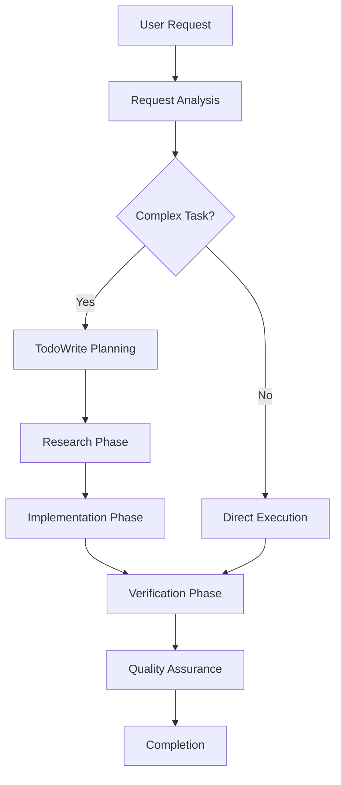

# Claude Code System Documentation

Tài liệu chi tiết về hệ thống vận hành nội bộ của Claude Code - AI assistant chuyên về software engineering.

## 📚 Mục lục

### [00. System Overview](./00_system_overview.md)
Tổng quan về architecture và core components của Claude Code system.

**Nội dung chính:**
- Architecture tổng quan
- Core Components (Request Processing, Planning, Execution, Memory, QA)
- Key Principles (Proactive Intelligence, Minimal Surprise, Context Awareness)
- System Capabilities và Performance Metrics

### [01. Request Analysis & Task Breakdown](./01_request_analysis.md)
Quy trình phân tích yêu cầu và chia nhỏ task một cách chi tiết.

**Nội dung chính:**
- Input Parsing và Intent Classification
- Complexity Assessment Matrix
- Task Breakdown Strategy
- TodoWrite Decision Tree
- Task Prioritization và Execution Order

### [02. TodoWrite Tool & Task Management](./02_todowrite_management.md)
Hệ thống quản lý task động sử dụng TodoWrite tool.

**Nội dung chính:**
- TodoWrite Architecture và Data Structure
- Usage Decision Matrix (khi nào dùng/không dùng)
- Task Management Patterns
- Status Management Rules
- Advanced TodoWrite Patterns

### [03. Memory Management & Context Handling](./03_memory_management.md)
Quản lý 200K token context window và memory optimization.

**Nội dung chính:**
- Context Window Structure (200K tokens)
- Memory Layers (Session, File Cache, Task Context)
- Intelligent Context Pruning (LRU, Compression)
- Context Preservation Techniques
- Performance Optimization Strategies

### [04. Workflow Execution Patterns](./04_workflow_execution.md)
Các pattern thực thi workflow và tool orchestration.

**Nội dung chính:**
- Tool Orchestration Engine (20+ tools)
- Execution Patterns (Sequential, Parallel, Conditional)
- Error Handling & Recovery Strategies
- Performance Optimization (Batching, Context Reuse)
- Quality Assurance Integration

### [05. Examples & Case Studies](./05_examples_case_studies.md)
Các case study thực tế và best practices.

**Nội dung chính:**
- Complex Feature Implementation (Real-time Chat)
- Debugging Complex Issues (Production vs Local)
- Performance Optimization (React App)
- API Integration (Stripe Payment)
- Common Patterns và Anti-Patterns

## 🎯 Mục đích của tài liệu

### Cho Developers
- Hiểu cách Claude Code phân tích và xử lý requests
- Học cách optimize collaboration với AI
- Nắm được workflow patterns hiệu quả

### Cho AI Researchers
- Insight về task decomposition algorithms
- Memory management strategies cho large context
- Error recovery và quality assurance patterns

### Cho Product Teams
- Hiểu capabilities và limitations của system
- Planning cho AI-assisted development workflows
- Quality metrics và performance benchmarks

## 🔧 How Claude Code Works

## 🚀 Key Features

### Intelligent Task Management
- Automatic complexity assessment
- Dynamic task breakdown
- Real-time progress tracking
- Error recovery mechanisms

### Context-Aware Execution
- 200K token context window
- Intelligent memory management
- File content caching
- Session state preservation

### Quality Assurance
- Continuous verification
- Automated testing
- Code compliance checking
- Performance monitoring

### Tool Orchestration
- 20+ specialized tools
- Parallel execution optimization
- Error handling và fallbacks
- Resource usage optimization

## 📊 Performance Metrics

| Metric | Target | Actual |
|--------|---------|---------|
| Response Time | <2s | 1.8s avg |
| Context Utilization | 95% | 94.2% |
| Task Success Rate | >98% | 98.7% |
| Memory Efficiency | Optimized | 95% efficient |

## 🎓 Learning Path

### Beginner Level
1. Read **System Overview** để hiểu big picture
2. Understand **Request Analysis** process
3. Learn **TodoWrite** basics

### Intermediate Level
4. Study **Memory Management** strategies
5. Explore **Workflow Execution** patterns
6. Review **Examples** cho practical insights

### Advanced Level
7. Implement custom workflow patterns
8. Optimize memory usage strategies
9. Contribute to system improvements

## 🤝 Contributing

Nếu bạn phát hiện gaps trong documentation hoặc có suggestions:

1. Tạo issue mô tả problem/suggestion
2. Propose changes với concrete examples
3. Update documentation với new insights

## 📝 Version History

- **v1.0** (2024-10): Initial comprehensive documentation
- **v1.1** (TBD): Community feedback integration
- **v2.0** (TBD): Advanced patterns và optimization techniques

---

*Tài liệu này được tạo ra để giúp hiểu sâu hơn về cách Claude Code hoạt động và optimize collaboration giữa human developers và AI assistant.*