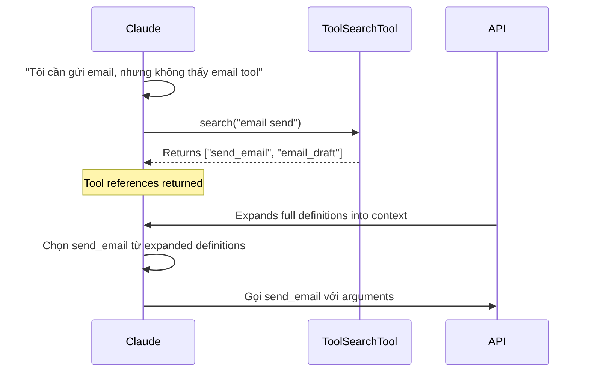

# Tool Search cho LangChain Agent

Document này trình bày cơ chế **Dynamic Tool Loading** (defer_loading) của Claude Code/Anthropic và cách triển khai tương tự cho LangChain `create_agent`.

## Table of Contents

1. [Claude Code Tool Search Mechanism](#claude-code-tool-search-mechanism)
2. [Vấn đề với LangChain create_agent](#vấn-đề-với-langchain-create_agent)
3. [Giải pháp với Middleware](#giải-pháp-với-middleware)
4. [Implementation Code](#implementation-code)
5. [So sánh với LangGraph](#so-sánh-với-langgraph)

---

## Claude Code Tool Search Mechanism

### Vấn đề mà Claude Code giải quyết

Khi AI agent có truy cập vào **hàng chục hoặc hàng trăm tools**, việc load tất cả tool definitions vào context gặp hai vấn đề nghiêm trọng:

1. **Context Bloat**: 50+ MCP tools có thể chiếm ~72,000 tokens, chiếm phần lớn context window
2. **Tool Selection Accuracy**: Model khó chọn đúng tool khi bị overwhelm bởi quá nhiều lựa chọn

### Cách hoạt động của `defer_loading`

```
┌─────────────────────────────────────────────────────────────────┐
│                      API Request                                │
├─────────────────────────────────────────────────────────────────┤
│  tools: [                                                       │
│    { name: "critical_tool_1", defer_loading: false },  ← Loaded │
│    { name: "critical_tool_2", defer_loading: false },  ← Loaded │
│    { name: "optional_tool_A", defer_loading: true },   ← Hidden │
│    { name: "optional_tool_B", defer_loading: true },   ← Hidden │
│    { name: "optional_tool_C", defer_loading: true },   ← Hidden │
│    ... (hundreds more deferred tools)                           │
│  ]                                                              │
└─────────────────────────────────────────────────────────────────┘
                              │
                              ▼
┌─────────────────────────────────────────────────────────────────┐
│                Claude's Initial Context                         │
├─────────────────────────────────────────────────────────────────┤
│  Available Tools:                                               │
│  - Tool Search Tool (regex or BM25 variant)                     │
│  - critical_tool_1 (full definition + args)                     │
│  - critical_tool_2 (full definition + args)                     │
│                                                                 │
│  Token Usage: ~500 tokens (thay vì ~72,000)                     │
└─────────────────────────────────────────────────────────────────┘
```

### Flow khi Claude cần một deferred tool



### Tool Search Tool Variants

Anthropic cung cấp 2 built-in variants:

| Variant | ID | Cách hoạt động |
|---------|-----|----------------|
| **Regex** | `tool_search_tool_regex_20251119` | Claude dùng regex patterns để search tool names, descriptions, arguments |
| **BM25** | `tool_search_tool_bm25_20251119` | Claude dùng natural language queries để search |

### API Request Example

```python
import anthropic

client = anthropic.Anthropic()

# Define tools với defer_loading
tools = [
    # Tool Search Tool - luôn available
    {
        "type": "tool_search_tool_bm25_20251119",
        "name": "search_tools",
        # Không cần defer_loading vì đây là search tool
    },
    # Critical tools - luôn load
    {
        "name": "get_current_time",
        "description": "Get current time",
        "input_schema": {...},
        "defer_loading": False,  # Hoặc không set
    },
    # Deferred tools - ẩn đi cho đến khi cần
    {
        "name": "send_email",
        "description": "Send an email to a recipient",
        "input_schema": {
            "type": "object",
            "properties": {
                "to": {"type": "string"},
                "subject": {"type": "string"},
                "body": {"type": "string"},
            },
            "required": ["to", "subject", "body"]
        },
        "defer_loading": True,  # ← Key flag
    },
    # ... nhiều deferred tools khác
]

response = client.messages.create(
    model="claude-sonnet-4-20250514",
    max_tokens=1024,
    tools=tools,
    messages=[{"role": "user", "content": "Send an email to john@example.com"}]
)
```

### Kết quả đạt được

- **Giảm ~85-95% token usage** cho tool definitions ban đầu
- **Scalability**: Hỗ trợ hàng trăm/ngàn tools mà không ảnh hưởng performance
- **Accuracy**: Model chọn tool chính xác hơn vì context không bị ô nhiễm

---

## Vấn đề với LangChain create_agent

### Cơ chế tool binding của LangChain

Khi bạn tạo agent với `create_agent`:

```python
from langchain.agents import create_agent

agent = create_agent(
    model="gpt-4o",
    tools=[tool_a, tool_b, tool_c],  # ← Tất cả tools bind ở đây
    middleware=[...],
)
```

LangChain thực hiện:

1. **Thu thập tools**: Lấy tất cả tools từ `tools=[]` parameter
2. **Extract schemas**: Lấy `name`, `description`, `input_schema` từ mỗi tool
3. **Bind to model**: Gọi `model.bind_tools([...])` một lần khi tạo agent
4. **Inject vào prompt**: Mỗi model call, all tool definitions được inject vào prompt

### Constraint quan trọng

```python
# Từ LangChain docs:
agent = create_agent(
    model="gpt-4o",
    tools=all_tools,  # ⚠️ "All available tools need to be registered upfront"
    middleware=[...],
)
```

> **Middleware chỉ có thể FILTER tools đã được register, KHÔNG THỂ ADD new tools.**

Điều này có nghĩa:
- ✅ Middleware có thể giấu tools khỏi model (không inject vào prompt)
- ❌ Middleware KHÔNG thể add tools mới chưa được register

### Bảng so sánh cơ chế

| Aspect | Claude Code (defer_loading) | LangChain (middleware) |
|--------|----------------------------|------------------------|
| **Tool registration** | Tất cả tools pass vào API | Tất cả tools pass vào `create_agent` |
| **Definition loading** | Chỉ load khi cần (lazy) | Bind tất cả upfront |
| **Context injection** | Chỉ non-deferred + searched tools | Controlled by middleware |
| **Add new tools runtime** | ❌ Không (phải có trong API call) | ❌ Không (phải register upfront) |
| **Hide tools** | ✅ `defer_loading: true` | ✅ `request.override(tools=[subset])` |

---

## Giải pháp với Middleware

### Approach: Simulating defer_loading

Vì cả Claude Code và LangChain đều yêu cầu tools registered upfront, chúng ta có thể simulate defer_loading bằng cách:

1. **Register tất cả tools** với `create_agent`
2. **Middleware ẩn tools** khỏi model ban đầu (chỉ expose ToolSearchTool)
3. **Khi agent gọi ToolSearchTool** → middleware update state với selected tools
4. **Các model call tiếp theo** → middleware expose selected tools

### Architecture

```
┌─────────────────────────────────────────────────────────────────┐
│                    create_agent(tools=[ALL])                    │
└─────────────────────────────────────────────────────────────────┘
                              │
                              ▼
┌─────────────────────────────────────────────────────────────────┐
│                  DynamicToolMiddleware                          │
├─────────────────────────────────────────────────────────────────┤
│  wrap_model_call(request, handler):                             │
│    1. Check state["loaded_tools"]                               │
│    2. If empty → expose only [tool_search]                      │
│    3. If has tools → expose [tool_search] + loaded_tools        │
│    4. request.override(tools=filtered_tools)                    │
│    5. return handler(request)                                   │
└─────────────────────────────────────────────────────────────────┘
                              │
                              ▼
┌─────────────────────────────────────────────────────────────────┐
│                         Model Call                              │
├─────────────────────────────────────────────────────────────────┤
│  First call: Model only sees tool_search                        │
│  After search: Model sees tool_search + selected tools          │
└─────────────────────────────────────────────────────────────────┘
```

---

## Implementation Code

### Step 1: Define Tool Registry

```python
from typing import Callable, Any
from dataclasses import dataclass, field

@dataclass
class ToolMetadata:
    """Metadata cho mỗi tool - dùng để search."""
    name: str
    description: str
    category: str  # e.g., "email", "file", "database"
    keywords: list[str] = field(default_factory=list)

class ToolRegistry:
    """Registry lưu trữ tất cả tools với metadata."""
    
    def __init__(self):
        self._tools: dict[str, Callable] = {}
        self._metadata: dict[str, ToolMetadata] = {}
    
    def register(
        self,
        tool: Callable,
        category: str,
        keywords: list[str] | None = None
    ) -> None:
        """Register một tool với metadata."""
        name = tool.name if hasattr(tool, 'name') else tool.__name__
        description = tool.description if hasattr(tool, 'description') else tool.__doc__ or ""
        
        self._tools[name] = tool
        self._metadata[name] = ToolMetadata(
            name=name,
            description=description,
            category=category,
            keywords=keywords or []
        )
    
    def get_tool(self, name: str) -> Callable | None:
        """Lấy tool callable theo name."""
        return self._tools.get(name)
    
    def get_all_tools(self) -> list[Callable]:
        """Lấy tất cả tools (dùng cho create_agent)."""
        return list(self._tools.values())
    
    def search(self, query: str, top_k: int = 5) -> list[ToolMetadata]:
        """
        Search tools dựa trên query.
        
        Simple implementation using keyword matching.
        Có thể upgrade lên embedding-based search sau.
        """
        query_lower = query.lower()
        results = []
        
        for name, meta in self._metadata.items():
            score = 0
            
            # Match name
            if query_lower in meta.name.lower():
                score += 10
            
            # Match description
            if query_lower in meta.description.lower():
                score += 5
            
            # Match category
            if query_lower in meta.category.lower():
                score += 3
            
            # Match keywords
            for kw in meta.keywords:
                if query_lower in kw.lower():
                    score += 2
            
            if score > 0:
                results.append((score, meta))
        
        # Sort by score descending
        results.sort(key=lambda x: x[0], reverse=True)
        return [meta for _, meta in results[:top_k]]
    
    def get_summary(self) -> str:
        """
        Trả về summary của tất cả tools theo category.
        Dùng để inject vào system prompt thay vì full definitions.
        """
        categories: dict[str, list[str]] = {}
        
        for meta in self._metadata.values():
            if meta.category not in categories:
                categories[meta.category] = []
            categories[meta.category].append(meta.name)
        
        lines = ["Available tool categories:"]
        for cat, tools in sorted(categories.items()):
            lines.append(f"- **{cat}**: {', '.join(tools)}")
        
        return "\n".join(lines)


# Global registry instance
TOOL_REGISTRY = ToolRegistry()
```

### Step 2: Define ToolSearch Tool

```python
from langchain.tools import tool

@tool
def tool_search(query: str) -> str:
    """
    Search for relevant tools based on a query.
    
    Use this tool when you need a specific capability but don't see the 
    appropriate tool available. This will search the tool catalog and 
    return relevant tools that you can then request to be loaded.
    
    Args:
        query: Natural language description of the capability you need.
               Example: "send email", "read file", "query database"
    
    Returns:
        A list of relevant tools with their descriptions.
        You should then call load_tools with the names of tools you want to use.
    """
    results = TOOL_REGISTRY.search(query, top_k=5)
    
    if not results:
        return f"No tools found matching '{query}'. Try a different search term."
    
    lines = [f"Found {len(results)} relevant tools:"]
    for meta in results:
        lines.append(f"\n**{meta.name}**")
        lines.append(f"  Category: {meta.category}")
        lines.append(f"  Description: {meta.description}")
    
    lines.append("\n\nTo use these tools, call load_tools with the tool names.")
    return "\n".join(lines)


@tool  
def load_tools(tool_names: list[str]) -> str:
    """
    Load specific tools into the agent's context.
    
    After using tool_search to find relevant tools, use this function to 
    load the tools you need. The tools will become available for use in
    subsequent actions.
    
    Args:
        tool_names: List of tool names to load. Must be valid tool names
                   returned from tool_search.
    
    Returns:
        Confirmation of which tools were loaded.
    """
    loaded = []
    not_found = []
    
    for name in tool_names:
        if TOOL_REGISTRY.get_tool(name):
            loaded.append(name)
        else:
            not_found.append(name)
    
    result_lines = []
    
    if loaded:
        result_lines.append(f"✅ Loaded tools: {', '.join(loaded)}")
        result_lines.append("These tools are now available for use.")
    
    if not_found:
        result_lines.append(f"❌ Not found: {', '.join(not_found)}")
    
    return "\n".join(result_lines)
```

### Step 3: Dynamic Tool Middleware

```python
from langchain.agents.middleware import AgentMiddleware, ModelRequest, ModelResponse
from langchain.messages import SystemMessage
from typing import Callable

class DynamicToolMiddleware(AgentMiddleware):
    """
    Middleware để implement defer_loading pattern.
    
    Cơ chế:
    1. Ban đầu chỉ expose tool_search và load_tools
    2. Khi agent gọi load_tools → update state với loaded_tools
    3. Các model call sau → expose loaded tools
    """
    
    # Core tools luôn available
    tools = [tool_search, load_tools]
    
    def __init__(self, tool_registry: ToolRegistry):
        self.registry = tool_registry
    
    def wrap_model_call(
        self,
        request: ModelRequest,
        handler: Callable[[ModelRequest], ModelResponse],
    ) -> ModelResponse:
        """Filter tools based on what's been loaded."""
        
        # Lấy loaded tools từ state
        loaded_tool_names: set[str] = request.state.get("loaded_tools", set())
        
        # Build filtered tool list
        filtered_tools = [tool_search, load_tools]
        
        for name in loaded_tool_names:
            tool = self.registry.get_tool(name)
            if tool:
                filtered_tools.append(tool)
        
        # Inject tool summary vào system prompt nếu là call đầu tiên
        if not loaded_tool_names:
            summary = self.registry.get_summary()
            addendum = (
                "\n\n## Tool Discovery\n\n"
                f"{summary}\n\n"
                "Use the `tool_search` tool to find specific tools, "
                "then `load_tools` to make them available."
            )
            
            if request.system_message:
                new_content = list(request.system_message.content_blocks) + [
                    {"type": "text", "text": addendum}
                ]
                new_system = SystemMessage(content=new_content)
                request = request.override(
                    system_message=new_system,
                    tools=filtered_tools
                )
            else:
                request = request.override(tools=filtered_tools)
        else:
            request = request.override(tools=filtered_tools)
        
        return handler(request)


class ToolLoadingMiddleware(AgentMiddleware):
    """
    Middleware xử lý kết quả của load_tools để update state.
    
    Chạy SAU model call để detect tool calls và update state.
    """
    
    def __init__(self, tool_registry: ToolRegistry):
        self.registry = tool_registry
    
    def wrap_model_call(
        self,
        request: ModelRequest,
        handler: Callable[[ModelRequest], ModelResponse],
    ) -> ModelResponse:
        """Intercept load_tools calls để update state."""
        
        # Gọi model
        response = handler(request)
        
        # Check nếu model gọi load_tools
        if response.tool_calls:
            for tool_call in response.tool_calls:
                if tool_call.name == "load_tools":
                    tool_names = tool_call.args.get("tool_names", [])
                    
                    # Update state
                    current = request.state.get("loaded_tools", set())
                    for name in tool_names:
                        if self.registry.get_tool(name):
                            current.add(name)
                    
                    # State sẽ được persist cho các calls tiếp theo
                    request.state["loaded_tools"] = current
        
        return response
```

### Step 4: Usage Example

```python
from langchain.agents import create_agent
from langchain.tools import tool

# === STEP 1: Define your tools ===

@tool
def send_email(to: str, subject: str, body: str) -> str:
    """Send an email to the specified recipient."""
    return f"Email sent to {to} with subject '{subject}'"

@tool
def read_file(path: str) -> str:
    """Read contents of a file."""
    return f"Contents of {path}"

@tool
def query_database(sql: str) -> str:
    """Execute a SQL query on the database."""
    return f"Query executed: {sql}"

@tool
def create_task(title: str, description: str) -> str:
    """Create a new task in the project management system."""
    return f"Task created: {title}"

# === STEP 2: Register tools với metadata ===

TOOL_REGISTRY.register(send_email, category="email", keywords=["mail", "message", "send"])
TOOL_REGISTRY.register(read_file, category="file", keywords=["read", "open", "content"])
TOOL_REGISTRY.register(query_database, category="database", keywords=["sql", "query", "data"])
TOOL_REGISTRY.register(create_task, category="project", keywords=["task", "todo", "ticket"])

# === STEP 3: Create agent với middleware ===

agent = create_agent(
    model="gpt-4o",
    # Register ALL tools upfront (LangChain requirement)
    tools=TOOL_REGISTRY.get_all_tools() + [tool_search, load_tools],
    middleware=[
        DynamicToolMiddleware(TOOL_REGISTRY),
        ToolLoadingMiddleware(TOOL_REGISTRY),
        # ... other existing middlewares
    ],
    system_prompt="""
You are a helpful assistant with access to various tools.

IMPORTANT: You don't see all tools immediately. When you need a specific 
capability:
1. Use `tool_search` to find relevant tools
2. Use `load_tools` to load the tools you need
3. Then use the loaded tools

This helps keep your context clean and focused.
"""
)

# === STEP 4: Invoke agent ===

result = agent.invoke({
    "messages": [
        {"role": "user", "content": "Send an email to john@example.com about the meeting"}
    ]
})
```

### Expected Agent Behavior

```
User: Send an email to john@example.com about the meeting

Agent thinking: I need to send an email but I don't see an email tool.
              Let me search for one.

Agent → tool_search(query="send email")

Tool Search Result:
  Found 1 relevant tools:
  
  **send_email**
    Category: email
    Description: Send an email to the specified recipient.
  
  To use these tools, call load_tools with the tool names.

Agent → load_tools(tool_names=["send_email"])

Load Tools Result:
  ✅ Loaded tools: send_email
  These tools are now available for use.

Agent → send_email(to="john@example.com", subject="Meeting", body="...")

Send Email Result:
  Email sent to john@example.com with subject 'Meeting'

Agent: Done! I've sent the email to john@example.com about the meeting.
```

---

## So sánh với LangGraph

### Khi nào dùng create_agent + Middleware

- ✅ Đã có middleware setup sẵn
- ✅ Số lượng tools < 100
- ✅ Không cần true lazy loading (tools đã được bind)
- ✅ Muốn giữ code đơn giản

### Khi nào cần migrate qua LangGraph

- ❌ Có > 100 tools và muốn lazy instantiation
- ❌ Cần control flow phức tạp (multi-agent, conditional routing)
- ❌ Cần custom tool execution logic

### Code comparison

**LangChain create_agent:**
```python
agent = create_agent(
    model="gpt-4o",
    tools=all_tools,  # Bind tất cả upfront
    middleware=[DynamicToolMiddleware()],
)
```

**LangGraph create_react_agent:**
```python
from langgraph.prebuilt import create_react_agent

def get_tools_for_state(state):
    """Dynamically return tools based on state."""
    loaded = state.get("loaded_tools", [])
    return [tool_search] + [TOOLS[name] for name in loaded]

agent = create_react_agent(
    model="gpt-4o",
    tools=get_tools_for_state,  # Function thay vì list
)
```

> **Note**: LangGraph không dùng middleware system. Logic phải được implement trong graph nodes hoặc tool functions.

---

## Limitations & Future Work

### Hiện tại

1. **Tools vẫn được bind upfront**: LangChain yêu cầu register tất cả tools trước
2. **State management**: Cần careful handling của `loaded_tools` state
3. **Search là keyword-based**: Có thể miss relevant tools

### Improvements có thể làm

1. **Embedding-based search**: Dùng vector DB để search tools
2. **LLM-based selector**: Dùng small model để chọn tools
3. **Caching**: Cache loaded tools across sessions
4. **Categories/tags UI**: Cho user biết tools có sẵn

---

## References

- [Anthropic: Introducing Advanced Tool Use](https://www.anthropic.com/news/introducing-advanced-tool-use)
- [Claude Docs: Tool Search Tool](https://docs.anthropic.com/en/docs/agents-and-tools/tool-use/tool-search)
- [LangChain: Custom Middleware](https://docs.langchain.com/oss/python/langchain/middleware/custom)
- [LangGraph: Dynamic Tool Selection](https://langchain-ai.github.io/langgraph/)
