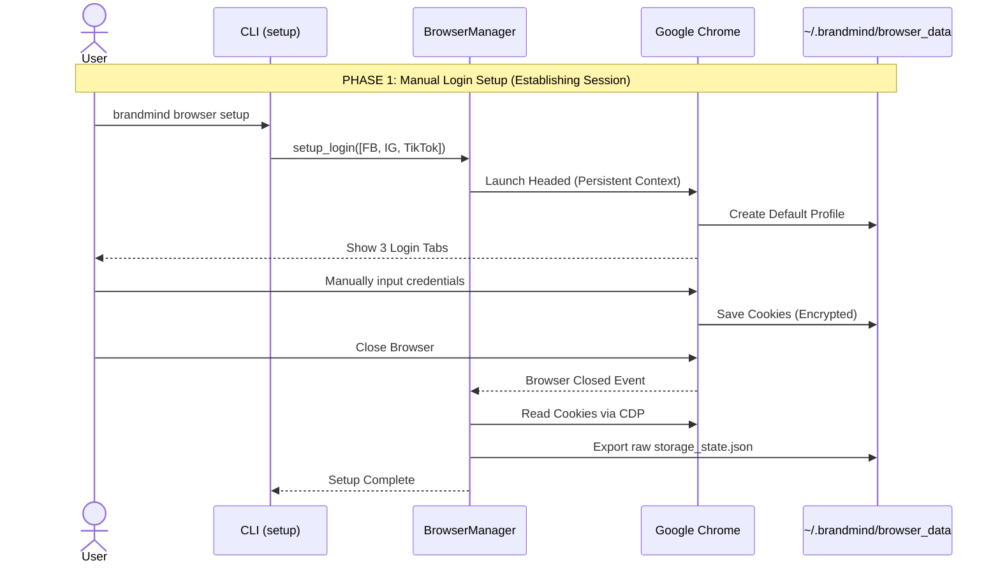
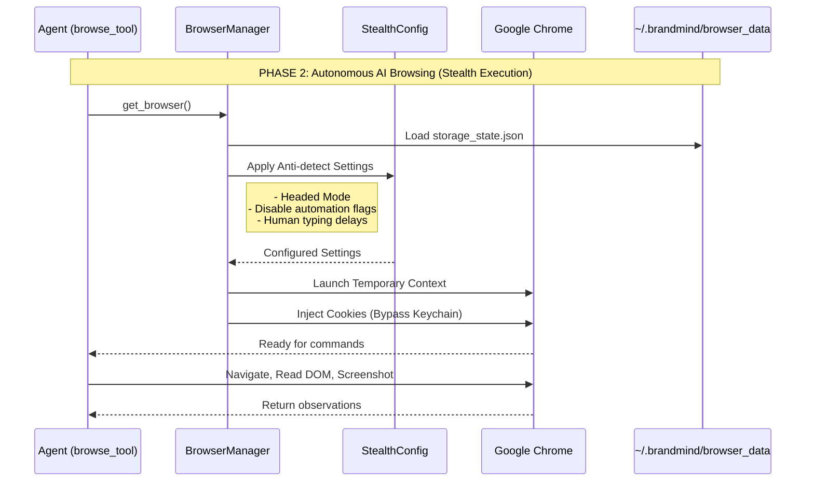

# BrandMind AI: Agent Web Browsing Tool

This module provides the core infrastructure for the **Agent Web Browsing Tool**, empowering the AI Agent to autonomously navigate, read, and extract data from major social media platforms (Facebook, Instagram, TikTok) and the open web.

## 🌟 Core Philosophy: Anti-Detect & Local-First

Unlike regular web crawlers, researching social media requires bypassing advanced bot-detection algorithms (like Meta's behavioral fingerprinting or Cloudflare turnstiles).

To achieve this, the tool is designed with a **"Stealth-First"** architecture:
1. **Host Chrome Integration**: It connects to the user's *actual* Google Chrome installation rather than using a suspicious, bundled Chromium binary.
2. **Session Isolation**: All browser data (cookies, cache) is saved to a dedicated sandbox (`~/.brandmind/browser_data/`), completely isolated from the user's personal browsing data.
3. **Four-Layer Stealth**: Configured via `StealthConfig`, the browser strips automation flags, maintains stable User-Agents, runs in headed mode (to leverage the OS's GPU/Fonts), and introduces human-like typing delays.

## 🏗️ Architecture & Workflow

The system operates in two distinct phases to maximize security and minimize account bans.

### Phase 1: Manual Login Setup (CLI)

AI agents are terrible at solving CAPTCHAs and handling 2FA. We delegate the initial login to the human user.



- **Command**: `brandmind browser setup`
- **Flow**: Playwright opens a visible Chrome window with a persistent profile. The user manually logs into their **Clone Accounts** on Facebook, Instagram, and TikTok.
- **Persistence**: Upon closing the browser, the module intercepts the encrypted cookies and exports them into a raw `storage_state.json` file. This is a critical step to bypass macOS Keychain encryption mismatches.

### Phase 2: Autonomous AI Browsing (Tool Execution)

When the agent requires live social media data, it requests the `browse_and_research` tool.



- **Flow**: The `create_browse_tool` factory injects the `BrowserManager` into the tool. The manager reads the `storage_state.json` (bypassing the OS Keychain) and launches a temporary Chrome context injected with the saved session cookies.
- **Execution**: `browser-use` takes over, analyzing the DOM via an accessibility tree, taking screenshots, and using the `gemini-3-flash-preview` model to decide on the next actions (click, type, scroll).
- **Result**: The agent extracts the required information and formats a summary back to the user.

## 📂 Module Structure

- **`browser_manager.py`**: Manages the Playwright lifecycle. Handles the two-phase workflow (`setup_login` and `get_browser`), storage state management, and session validation.
- **`stealth_config.py`**: Defines the `StealthConfig` Pydantic model. Centralizes all anti-detection settings (Viewport, User-Agent, automation flag removal).
- **`browser_tool.py`**: The agent-facing interface. Contains the `create_browse_tool()` factory that binds LLMs (`ChatGoogle`) and the `BrowserManager` together to expose a clean async function `browse_and_research(task: str)` for the AI agent framework.

## 🚀 Available CLI Commands

This module hooks into the main CLI (`src/cli/inference.py`) to expose these management commands:

```bash
# Launch interactive browser to log into social accounts (Phase 1)
brandmind browser setup

# Check if a valid login session exists in the sandbox
brandmind browser status

# Delete the isolated sandbox to start fresh
brandmind browser reset
```

## ⚠️ Security Advisory

**Always use "Clone Accounts" (secondary/burner accounts) for AI research.**

While the 4-layer stealth system is highly effective, social media networks frequently update their detection algorithms. If an account is flagged, it may face temporary restrictions or permanent bans. By strictly using clone accounts within this isolated sandbox, your personal or primary business accounts remain 100% secure.
